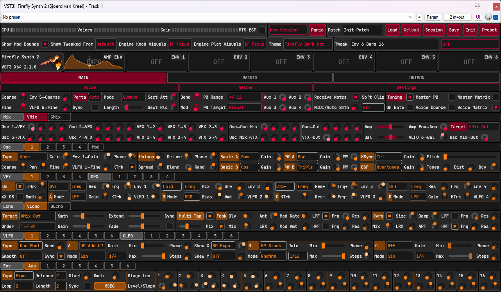
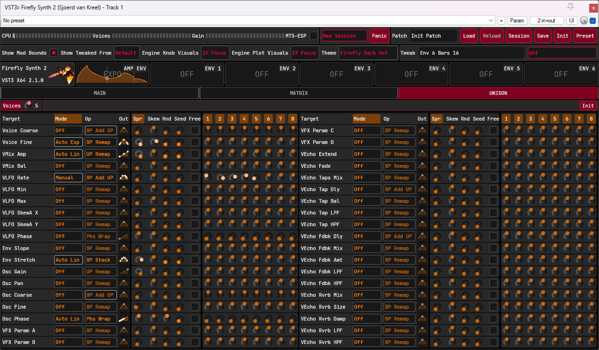
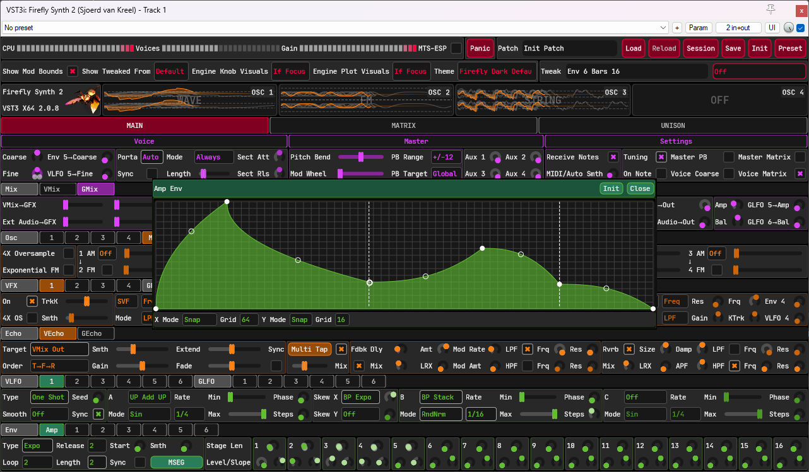

# Nearly ready for V2
See [host_test](https://github.com/sjoerdvankreel/firefly-synth-2/tree/main/host_test) for host compatibility tests. 
See [demo](https://github.com/sjoerdvankreel/firefly-synth-2/tree/main/demo) for feature tests, and some nice demos along the way. 
Read the [Manual](/static/Manual.md). Click the outline (3 dashes) menu for table-of-contents. 

# Legal
<table>
  <tr>
    <td></td>
    <td><a href="https://github.com/free-audio/clap">https://github.com/free-audio/clap</a></td>
    <td></td>
    <td>VST is a trademark of Steinberg Media Technologies GmbH, registered in Europe and other countries.</td>
  </tr>
</table>

# How To Build
* Git clone recursive
* Build scripts are in /scripts: build_windows.bat/build_linux.sh/build_mac.bat
* build_xyz Debug|RelWithDebInfo|Release (0|1):(warn as error) (0|1):(enable asan)

# Special Thanks
* [RustoMCSpit](https://github.com/RustoMCSpit) 
For being an early adopter, and helping out with various things on the UI and theming side.
* [Surge Synth Team](https://surge-synth-team.org) 
For help with loads of stuff, from low-level technical details to CLAP support to microtuning and probably more.

# Host Support
Tested on Carla, Bitwig, Ardour, FLStudio, Reaper and Renoise. 
It should work ok on others as well (f.e. known to work on QTractor). 

Unfortunately Renoise is not officially supported because of 
[https://forum.renoise.com/t/saved-automation-data-does-not-respect-vst3s-parameter-id/68461](https://forum.renoise.com/t/saved-automation-data-does-not-respect-vst3s-parameter-id/68461). 
You can use it as long as you don't update the plugin (read: install once, and never again). 
Updating the plugin might or might not work, but in any case, it's dangerous. 

# Known Issues
* String oscillator responds to sample rate, but it shouldn't. 
Pitch is good, timbre is not. Long-standing issue, might prove difficult.
* Looks like FLStudio and FF2 disagree on what the default value for MIDI modwheel should be.
This causes clicking which you can get rid off by disabled MIDI modwheel in the global mod matrix.
If you actually do need and use it, let me know how it fares.
* "Show Manual"/"Show Log Folder"/"Show Plugin Folder" context menu options are broken on some Linux hosts. 
Workaround: go find those folders yourself, and the manual is over [here](/static/Manual.md). 
TODO: list the relevant folder locations (user data / plugin binary) for all OSes right here in this document.
* Some hosts do not paint the realtime visualization (graphs and knobs) for VST3.
This affects mostly Linux hosts, but some Windows/Mac as well.
CLAP should be OK everywhere, and even for VST3 it's not a big deal, just means you don't get realtime visual feedback. 
Maybe related: https://forums.steinberg.net/t/dataexchange-on-linux/917660/4. 

# Dependencies
- CLAP SDK: [https://github.com/free-audio/clap](https://github.com/free-audio/clap)
- JUCE: [https://github.com/juce-framework/JUCE](https://github.com/juce-framework/JUCE)
- Xsimd: [https://github.com/xtensor-stack/xsimd](https://github.com/xtensor-stack/xsimd)
- MTS-ESP: [https://github.com/ODDSound/MTS-ESP](https://github.com/ODDSound/MTS-ESP)
- Steinberg VST3 SDK: [https://github.com/steinbergmedia/vst3sdk](https://github.com/steinbergmedia/vst3sdk)
- Readerwriterqueue: [https://github.com/cameron314/readerwriterqueue](https://github.com/cameron314/readerwriterqueue)

# Credits
* Same (modified) Freeverb: https://github.com/sinshu/freeverb.
* Stole the color-morphing noise algo from here: https://sampo.kapsi.fi/PinkNoise/.
* Same soft clippers: https://dafx.de/paper-archive/2012/papers/dafx12_submission_45.pdf.
* Same DSF algorithm: https://www.verklagekasper.de/synths/dsfsynthesis/dsfsynthesis.html.
* Same state variable filter: https://www.cytomic.com/files/dsp/SvfLinearTrapOptimised2.pdf.
* Smooth noise: https://www.scratchapixel.com/lessons/procedural-generation-virtual-worlds/procedural-patterns-noise-part-1/creating-simple-1D-noise.html
* Stole the new osci algos from here: https://www.taletn.com/reaper/mono_synth/. 
You have to download the zip to get at the PolyBLEP source for all waveforms.

# Demo Material
* Plucked strings
[mp3](https://github.com/sjoerdvankreel/firefly-synth-storage/raw/main/firefly-2/render/demo_pluckstring.mp3)
[reaper](https://github.com/sjoerdvankreel/firefly-synth-2/raw/main/demo/demo_pluckstring.rpp)
* FM + distortion 1
[mp3](https://github.com/sjoerdvankreel/firefly-synth-storage/raw/main/firefly-2/render/demo_fm_distortion_1.mp3)
[reaper](https://github.com/sjoerdvankreel/firefly-synth-2/raw/main/demo/demo_fm_distortion_1.rpp)
* FM + distortion 2
[mp3](https://github.com/sjoerdvankreel/firefly-synth-storage/raw/main/firefly-2/render/demo_fm_distortion_2.mp3)
[reaper](https://github.com/sjoerdvankreel/firefly-synth-2/raw/main/demo/demo_fm_distortion_2.rpp)
* Bowed strings
[mp3](https://github.com/sjoerdvankreel/firefly-synth-storage/raw/main/firefly-2/render/demo_bowstring.mp3)
[reaper](https://github.com/sjoerdvankreel/firefly-synth-2/raw/main/demo/demo_bowstring.rpp)
[video](https://github.com/sjoerdvankreel/firefly-synth-storage/raw/main/firefly-2/video/demo_bowstring_video.mp4)
* FM + lfo demo
[mp3](https://github.com/sjoerdvankreel/firefly-synth-storage/raw/main/firefly-2/render/demo_fm_lfo_filter.mp3)
[reaper](https://github.com/sjoerdvankreel/firefly-synth-2/raw/main/demo/demo_fm_lfo_filter.rpp)
[video](https://github.com/sjoerdvankreel/firefly-synth-storage/raw/main/firefly-2/video/demo_fm_lfo_filter.mp4)
* Plucked strings + echo
[mp3](https://github.com/sjoerdvankreel/firefly-synth-storage/raw/main/firefly-2/render/demo_echo_pluckstring.mp3)
[reaper](https://github.com/sjoerdvankreel/firefly-synth-2/raw/main/demo/demo_echo_pluckstring.rpp)
* FM + echo + echo mod
[mp3](https://github.com/sjoerdvankreel/firefly-synth-storage/raw/main/firefly-2/render/demo_echo_fm_and_echo_mod.mp3)
[reaper](https://github.com/sjoerdvankreel/firefly-synth-2/raw/main/demo/demo_echo_fm_and_echo_mod.rpp)
* Saw + echo + echo mod
[mp3](https://github.com/sjoerdvankreel/firefly-synth-storage/raw/main/firefly-2/render/demo_echo_saw_and_echo_mod.mp3)
[reaper](https://github.com/sjoerdvankreel/firefly-synth-2/raw/main/demo/demo_echo_saw_and_echo_mod.rpp)
* Mod matrix demo
[mp3](https://github.com/sjoerdvankreel/firefly-synth-storage/raw/main/firefly-2/render/demo_matrix_pad.mp3)
[reaper](https://github.com/sjoerdvankreel/firefly-synth-2/raw/main/demo/demo_matrix_pad.rpp)
[video](https://github.com/sjoerdvankreel/firefly-synth-storage/raw/main/firefly-2/video/demo_matrix_pad.mp4)
* Distortion (still love it)
[mp3](https://github.com/sjoerdvankreel/firefly-synth-storage/raw/main/firefly-2/render/demo_distortion.mp3)
[reaper](https://github.com/sjoerdvankreel/firefly-synth-2/raw/main/demo/demo_distortion.rpp)
[video](https://github.com/sjoerdvankreel/firefly-synth-storage/raw/main/firefly-2/video/demo_distortion_video.mp4)
* Plucked strings + per-voice echo mod
[mp3](https://github.com/sjoerdvankreel/firefly-synth-storage/raw/main/firefly-2/render/demo_voice_echo_pluckstring_and_voice_echo_mod.mp3)
[reaper](https://github.com/sjoerdvankreel/firefly-synth-2/raw/main/demo/demo_voice_echo_pluckstring_and_voice_echo_mod.rpp)
* GUI Reacting to Bitwig per-voice-modulation demo
[video](https://github.com/sjoerdvankreel/firefly-synth-storage/raw/main/firefly-2/video/demo_bitwig_clap_polymod.mp4)
* Per-voice echo applied to only one out of 2 osci's
[mp3](https://github.com/sjoerdvankreel/firefly-synth-storage/raw/main/firefly-2/render/demo_voice_echo_one_osci_only.mp3)
[reaper](https://github.com/sjoerdvankreel/firefly-synth-2/raw/main/demo/demo_voice_echo_one_osci_only.rpp)
* Global unison with different per-voice settings for coarse pitch, voice lfo to voice filter, and echo
[mp3](https://github.com/sjoerdvankreel/firefly-synth-storage/raw/main/firefly-2/render/demo_global_uni_lfo_echo.mp3)
[reaper](https://github.com/sjoerdvankreel/firefly-synth-2/raw/main/demo/demo_global_uni_lfo_echo.rpp)

# Screenshots

