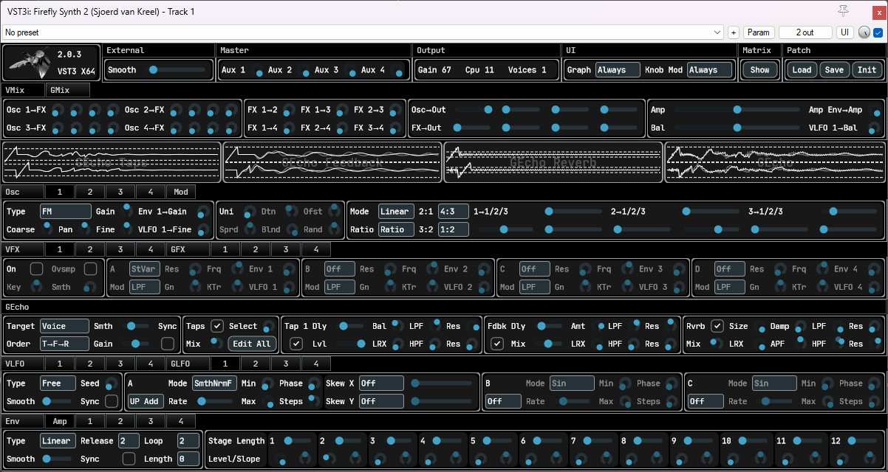

# This is not a finished product
* But it is a functioning clap and vst3 plugin.
* Builds and runs on win/lin/mac. ARM mac only, no intel.
* Only tested on reaper and bitwig.
* Only osci, inter-osci mod, string osci, per-voice fx, global fx and envelopes implemented.
* Stock JUCE GUI, no patch saving/loading, no presets, no delay, reverb, LFO's, MTS-ESP, no routing matrices (routing is hardcoded),
even ENV1 is only connected to per-voice amp, the others route nowhere. Let alone stuff like an arpeggiator.

# Some demo material
* Bowed strings
[mp3](https://github.com/sjoerdvankreel/firefly-synth-storage/raw/main/firefly-2/render/demo_bowstring.mp3)
[reaper](https://github.com/sjoerdvankreel/firefly-synth-2/raw/main/demo/demo_bowstring.rpp)
* Distortion (still love it)
[mp3](https://github.com/sjoerdvankreel/firefly-synth-storage/raw/main/firefly-2/render/demo_distortion.mp3)
[reaper](https://github.com/sjoerdvankreel/firefly-synth-2/raw/main/demo/demo_distortion.rpp)
[video](https://github.com/sjoerdvankreel/firefly-synth-storage/raw/main/firefly-2/video/demo_distortion_video.mp4)
* Plucked strings
[mp3](https://github.com/sjoerdvankreel/firefly-synth-storage/raw/main/firefly-2/render/demo_pluckstring.mp3)
[reaper](https://github.com/sjoerdvankreel/firefly-synth-2/raw/main/demo/demo_pluckstring.rpp)
(just noticed this one clicks a bit, so that's a bug)
* GUI Reacting to Bitwig per-voice-modulation demo
[video](https://github.com/sjoerdvankreel/firefly-synth-storage/raw/main/firefly-2/video/demo_bitwig_clap_polymod.mp4)
* TODO demo the new dedicated FM osci. It does feedback FM, too.

The distortion demo is actually interesting to look at the reaper file. It makes use of envelope loop points,
keytracking state variable filters and keytracking comb filters. Because of the keytracking each engine voice
shows up as a different line (frequency response in the filter case, but the same applies to oscis and envelopes)
in the graph plot. See bottom of the page for screenshot.

# Why yet another one?
There's a couple things i wanted to do that prove difficult to retrofit onto FF1.
This is stuff that has to be built-in from the ground up, which would essentially mean a complete rewrite anyway.
The big ones are 1) make it faster, 2) provide accurate graphs of the per-voice audio engine state, and 3) support clap polyphonic modulation.
* Finally bit the bullet and made it SIMD-friendly. Flat structs everywhere, proper alignment, no pointer chasing, and a bit of manual (x)simd where it makes sense.
* Fixed internal block size (16) instead of maximum internal block size (so, PDC). This plays nicely into simd-friendly datastructures.
* Both the audio engine and the GUI keep a copy of the per-voice parameter state to allow accurate reconstruction of the engine state in graphs. Synced each host (not internal) block.
* The actual audio engine state is now a dense buffer per-voice-per-parameter (for per voice params that are automatable/modulatable per sample).
Not the most memory-efficient setup, but easily doable with 16 block size, and makes it really straightforward to do simd stuff.
* Net result so far is something that's easily twice as fast (or less slow, if you will ;) and at the same time provides superior visualization.
* I also took the opportunity to fix some other issues with FF1 that did not necessarily warrant a rewrite, but whatever. I got FM wrong (again) in FF1, hard-sync anything just doesn't work, and more.
* And of course, the opportunity to improve upon existing stuff. Keyboard tracking comb filters, pitch modulatable karplus-strong, 
continuous morphing white to pink to brown noise, looping envelopes, and more to come. See below for a more detailed overview of what's new and improved.

# So whats the planning?
* To finish it ;)
* Instead of working in the dark for a year or more i figured, i have something that runs, let's build from here.
* The idea is to do an alpha release per feature. New module (say echo, lfo), midi support, skin the gui, linux/mac, whatever.
* Untill the thing's finally KVR-ready, get it out of alpha, and add non-essential features from there.

# Credits
* Special thanks to Surge Synth Team as always.
* Same soft clippers: https://dafx.de/paper-archive/2012/papers/dafx12_submission_45.pdf.
* Same DSF algorithm: https://www.verklagekasper.de/synths/dsfsynthesis/dsfsynthesis.html.
* Same state variable filter: https://www.cytomic.com/files/dsp/SvfLinearTrapOptimised2.pdf.
* Stole the color-morphing noise algo from here: https://sampo.kapsi.fi/PinkNoise/.
* Stole the new osci algos from here: https://www.taletn.com/reaper/mono_synth/. You have to download the zip to get at the PolyBLEP source for all waveforms.

# The details

## FX
* A single FX slot is optionally oversampled "as a whole".
* A bit like osci, for each FX slot, take your pick of 4 sub-slots.
* All waveshapers have a new bias param to allow for asymmetric shaping.
* 4x choice of wave folder, wave clipper, wave skewer, state var filter, comb filter.
* These are processed in order. AKA "build your own distortion module".
* Keyboard tracking center key with -64 to +64 semis, 0 is C4. Global tracks the last MIDI key.
* For global FX, new smoothing param for incoming last-midi-key. Prevents jumps when keytracking global filters.

## Envelope
* 9 stage EG. I guess this classifies as an MSEG, but, no visual editor.
* Per stage amp and slope, per-sample automate/modulate.
* Stage length per-voice-start automate/modulate when not tempo-synced.
* Linear/expo mode, 2 loop points for the sustain stage, any point can be release point, optional tempo sync, optional signal smoothing.

## Osci
* Note: it would be wise to set the osci mod matrix to oversample if you use either the dedicated FM generator or the inter-osci FM mods.
* Comes with unison stereo spread, detune, phase offset, 2 new ones: voice blend and phase offset randomization (gets rid off the phasing effect).
* For "wave" mode, get 6 sub-oscis, 2 fixed waveforms, 2 pwm-modulatable waveforms, 1 hardsync-capable waveform, and 1 dsf generator.
* For "fm" mode, a 3-op FM generator with 3x3 matrix, unit delay on the feedback path, free or rational (0.25 or 1:4) C:M ratios, choice of linear or exponential FM.
* There are loads of new waveforms, see credits below. I stole a bunch of properly BLEP'ed algo's.
These also include fully BLEP'ed hardsync versions of saw/sqr/tri. These are superior to FF1's hardsync-anything, so hardsync-anything is out.

## Osci mod matrix
* Oversampling applies to all osci's (not string).
* Inter-osci AM/RM/FM, with (new) exponential FM.
* Like FF1's, but no need to point-and-click, just drag the sliders, because the matrix is already set up.
* All modulations are still per-unison-voice. Make sure the mod source has at least as many uni voices as the target.
* FF1 was actually doing "real" FM instead of PM. That bit me when i was doing feedback FM on the dedicated FM osci, and the pitch went down.

## String osci
* Brought back the "frozen noise" from infernal synth.
* Continous white-to-pink-to-brown noise, uniform or gaussian.
* Comes with unison stereo spread, detune, voice blend (new unison param).
* Finally does proper pitch shifting. Accomplished by replacing circular buffer by fractional delay line.
* This one doubles as a noise osci and string osci. Turn the excite param all the way up for full-on noise.
* Don't know if this is still karplus-strong, or waveguides, or anywhere in between, or something else. It's different from the one in FF1 in any case.
* Also new, excite param controls how much new noise to feedback into the delay line (for bowed strings). Optional LPF/HPF for more control of the feedback loop.
* Separated out the string osci from the regular osci. The regular one is phase-based, this one is not. It does not participate in the osci mod matrix and it has less unison controls.

# Build it
As always. Git clone recursive, build scripts are in /scripts, build_windows|linux|mac.bat|sh Debug|RelWithDebInfo|Release.

# Screenshot
