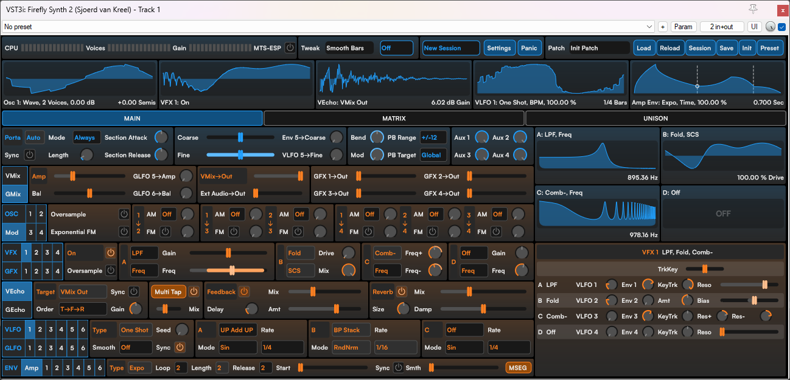
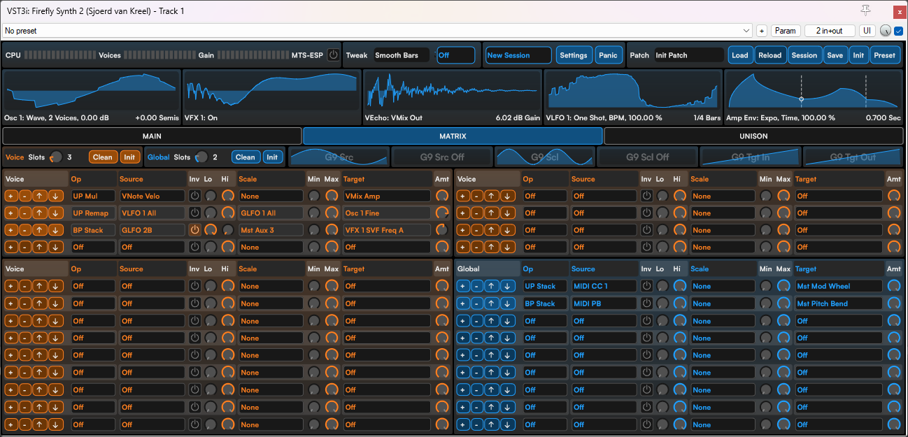
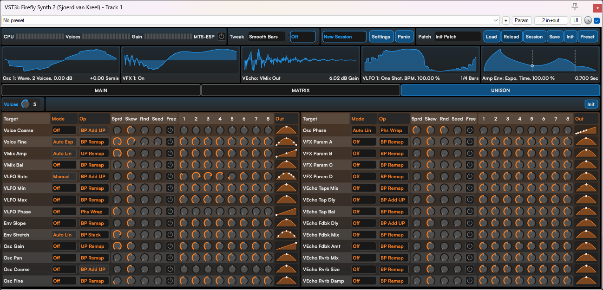
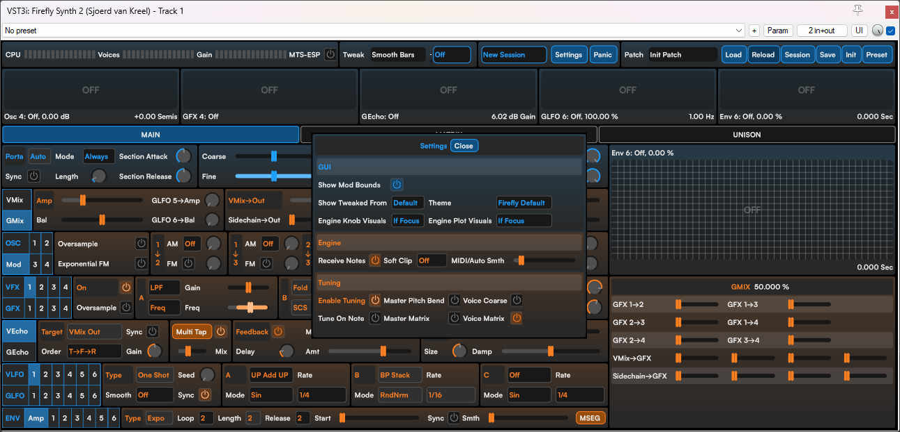
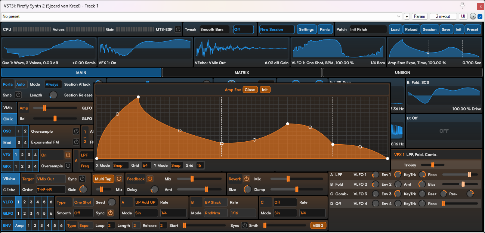

Read the [Comparison to FF1](/static/compare_to_ff1.md). 
Read the [Manual](/static/Manual.md). Click the outline (3 dashes) menu for table-of-contents. 
 
See [FF2 on KVR](https://www.kvraudio.com/product/firefly-synth-2-by-sjoerdvankreel). 
See [Quick feature overview](/static/Features.md). 
See [host_test](https://github.com/sjoerdvankreel/firefly-synth-2/tree/main/host_test) for host compatibility tests. 
See [demo](https://github.com/sjoerdvankreel/firefly-synth-2/tree/main/demo) for feature tests, and some nice demos along the way. 

# Legal
<table>
  <tr>
    <td></td>
    <td><a href="https://github.com/free-audio/clap">https://github.com/free-audio/clap</a></td>
    <td></td>
    <td>VST is a trademark of Steinberg Media Technologies GmbH, registered in Europe and other countries.</td>
  </tr>
</table>

# Download
See the [Releases](https://github.com/sjoerdvankreel/firefly-synth-2/releases) section.

# Install
* Remove the previous version (if any) from your VST3/CLAP plugin folder. 
All of it, entire folder, not just the binary.
* Copy the new version folder to your VST3/CLAP plugin folder. 
The entire folder, not just the binary.

# Build From Source
* Git clone recursive
* Build scripts are in /scripts: build_windows.bat/build_linux.sh/build_mac.bat
* build_xyz Debug|RelWithDebInfo|Release (0|1):(warn as error) (0|1):(enable asan)

# Platform Support
* Windows 10+, X64
* Linux X64, glibc 2.35+
* MacOS 10.15+, X64/ARM

# Host Support
Tested on Carla, Bitwig, Ardour, FLStudio, Reaper and Renoise. 
It should work ok on others as well (f.e. known to work on QTractor). 

Unfortunately Renoise is not officially supported because of 
[https://forum.renoise.com/t/saved-automation-data-does-not-respect-vst3s-parameter-id/68461](https://forum.renoise.com/t/saved-automation-data-does-not-respect-vst3s-parameter-id/68461). 
You can use it as long as you don't update the plugin (read: install once, and never again). 
Updating the plugin might or might not work, but in any case, it's dangerous. 
 
If your dead-set on using Renoise, after installing a new version of the plugin, 
load an existing project and check the logfile. 
If it says "Parameter indices are stable" (everywhere), all good. 
If it says "PARAMETER INDICES HAVE CHANGED" (anywhere), need to re-check your automation lanes. 
You can use the menu option "Dump ParamList" to compare what params are on old and new indices.

# Relevant Directories
## Plugin Folder
* Mac: /Library/Audio/Plug-ins/VST3, /Library/Audio/Plug-ins/CLAP (global)
* Linux: /usr/lib/vst3, /usr/lib/clap (global), $HOME/.vst3, $HOME/.clap (user)
* Windows: Program Files/Common Files/VST3, Program Files/Common Files/CLAP (global)

The exact rules are laid out [here](https://steinbergmedia.github.io/vst3_dev_portal/pages/Technical+Documentation/Locations+Format/Plugin+Locations.html) for VST3. 
I haven't checked for CLAP, but I would be surprised if they are any different.

## User App Data Folder
Currently only stores the logfile. 
This is whatever JUCE decides it should be, adjusted for XDG_CONFIG_HOME on Linux. 
See [https://docs.juce.com/master/classjuce_1_1File.html](https://docs.juce.com/master/classjuce_1_1File.html) and search for "userApplicationDataDirectory".

For me, it is:
* Linux: ~/.config/Sjoerd van Kreel/Firefly Synth 2
* Mac: /users/USERNAME/Library/Sjoerd van Kreel/Firefly Synth 2
* Windows: C:\Users\USERNAME\AppData\Roaming\Sjoerd van Kreel\Firefly Synth 2

# Known Issues
* String oscillator responds to sample rate, but it shouldn't. 
Pitch is good, timbre is not. Long-standing issue, might prove difficult.
* Looks like FLStudio and FF2 disagree on what the default value for MIDI modwheel/pitchbend should be.
This causes clicking which you can get rid of by disabling MIDI modwheel/pitchbend sources in the global mod matrix (PB is on by default).
If you actually do need and use it, let me know how it fares.
* "Show Manual"/"Show Log Folder"/"Show Plugin Folder" context menu options are broken on some Linux hosts. 
Workaround: go find those folders yourself (see above), and the manual is over [here](/static/Manual.md).
* Some hosts do not paint the realtime visualization (graphs and knobs) for VST3.
This affects mostly Linux hosts, but some Windows/Mac as well.
CLAP should be OK everywhere, and even for VST3 it's not a big deal, just means you don't get realtime visual feedback. 
Maybe related: https://forums.steinberg.net/t/dataexchange-on-linux/917660/4. 

# Special Thanks
* [thoth-amon](https://github.com/thoth-amon) 
For being an early adopter and finding all sorts of corner-case bugs.
* [RustoMCSpit](https://github.com/RustoMCSpit) 
For being an early adopter and helping out with various things on the UI and theming side.
* [Surge Synth Team](https://surge-synth-team.org) 
For help with loads of stuff, from low-level technical details to CLAP support to microtuning and probably more.

# Dependencies
- CLAP SDK: [https://github.com/free-audio/clap](https://github.com/free-audio/clap)
- JUCE: [https://github.com/juce-framework/JUCE](https://github.com/juce-framework/JUCE)
- Xsimd: [https://github.com/xtensor-stack/xsimd](https://github.com/xtensor-stack/xsimd)
- MTS-ESP: [https://github.com/ODDSound/MTS-ESP](https://github.com/ODDSound/MTS-ESP)
- Steinberg VST3 SDK: [https://github.com/steinbergmedia/vst3sdk](https://github.com/steinbergmedia/vst3sdk)
- Readerwriterqueue: [https://github.com/cameron314/readerwriterqueue](https://github.com/cameron314/readerwriterqueue)

# Credits
* Same (modified) Freeverb: https://github.com/sinshu/freeverb.
* Stole the color-morphing noise algo from here: https://sampo.kapsi.fi/PinkNoise/.
* Same soft clippers: https://dafx.de/paper-archive/2012/papers/dafx12_submission_45.pdf.
* Same DSF algorithm: https://www.verklagekasper.de/synths/dsfsynthesis/dsfsynthesis.html.
* Same state variable filter: https://www.cytomic.com/files/dsp/SvfLinearTrapOptimised2.pdf.
* Smooth noise: https://www.scratchapixel.com/lessons/procedural-generation-virtual-worlds/procedural-patterns-noise-part-1/creating-simple-1D-noise.html
* Stole the new osci algos from here: https://www.taletn.com/reaper/mono_synth/. 
You have to download the zip to get at the PolyBLEP source for all waveforms.

# Demo Material

## Short tracks
* Short 1
[mp3](https://github.com/sjoerdvankreel/firefly-synth-storage/raw/main/firefly-2/render/demo_short_01.mp3)
[renoise](https://github.com/sjoerdvankreel/firefly-synth-2/raw/main/demo/demo_short_01.xrns)
* Short 2
[mp3](https://github.com/sjoerdvankreel/firefly-synth-storage/raw/main/firefly-2/render/demo_short_02.mp3)
[renoise](https://github.com/sjoerdvankreel/firefly-synth-2/raw/main/demo/demo_short_02.xrns)
* Short 2 (builtin compressor)
[mp3](https://github.com/sjoerdvankreel/firefly-synth-storage/raw/main/firefly-2/render/demo_short_02_compress.mp3)
[renoise](https://github.com/sjoerdvankreel/firefly-synth-2/raw/main/demo/demo_short_02_compress.xrns)

## Feature demos
* Plucked strings
[mp3](https://github.com/sjoerdvankreel/firefly-synth-storage/raw/main/firefly-2/render/demo_pluckstring.mp3)
[reaper](https://github.com/sjoerdvankreel/firefly-synth-2/raw/main/demo/demo_pluckstring.rpp)
* FM + distortion 1
[mp3](https://github.com/sjoerdvankreel/firefly-synth-storage/raw/main/firefly-2/render/demo_fm_distortion_1.mp3)
[reaper](https://github.com/sjoerdvankreel/firefly-synth-2/raw/main/demo/demo_fm_distortion_1.rpp)
* FM + distortion 2
[mp3](https://github.com/sjoerdvankreel/firefly-synth-storage/raw/main/firefly-2/render/demo_fm_distortion_2.mp3)
[reaper](https://github.com/sjoerdvankreel/firefly-synth-2/raw/main/demo/demo_fm_distortion_2.rpp)
* Bowed strings
[mp3](https://github.com/sjoerdvankreel/firefly-synth-storage/raw/main/firefly-2/render/demo_bowstring.mp3)
[reaper](https://github.com/sjoerdvankreel/firefly-synth-2/raw/main/demo/demo_bowstring.rpp)
[video](https://github.com/sjoerdvankreel/firefly-synth-storage/raw/main/firefly-2/video/demo_bowstring_video.mp4)
* FM + lfo demo
[mp3](https://github.com/sjoerdvankreel/firefly-synth-storage/raw/main/firefly-2/render/demo_fm_lfo_filter.mp3)
[reaper](https://github.com/sjoerdvankreel/firefly-synth-2/raw/main/demo/demo_fm_lfo_filter.rpp)
[video](https://github.com/sjoerdvankreel/firefly-synth-storage/raw/main/firefly-2/video/demo_fm_lfo_filter.mp4)
* Plucked strings + echo
[mp3](https://github.com/sjoerdvankreel/firefly-synth-storage/raw/main/firefly-2/render/demo_echo_pluckstring.mp3)
[reaper](https://github.com/sjoerdvankreel/firefly-synth-2/raw/main/demo/demo_echo_pluckstring.rpp)
* FM + echo + echo mod
[mp3](https://github.com/sjoerdvankreel/firefly-synth-storage/raw/main/firefly-2/render/demo_echo_fm_and_echo_mod.mp3)
[reaper](https://github.com/sjoerdvankreel/firefly-synth-2/raw/main/demo/demo_echo_fm_and_echo_mod.rpp)
* Saw + echo + echo mod
[mp3](https://github.com/sjoerdvankreel/firefly-synth-storage/raw/main/firefly-2/render/demo_echo_saw_and_echo_mod.mp3)
[reaper](https://github.com/sjoerdvankreel/firefly-synth-2/raw/main/demo/demo_echo_saw_and_echo_mod.rpp)
* Mod matrix demo
[mp3](https://github.com/sjoerdvankreel/firefly-synth-storage/raw/main/firefly-2/render/demo_matrix_pad.mp3)
[reaper](https://github.com/sjoerdvankreel/firefly-synth-2/raw/main/demo/demo_matrix_pad.rpp)
[video](https://github.com/sjoerdvankreel/firefly-synth-storage/raw/main/firefly-2/video/demo_matrix_pad.mp4)
* Osci to osci compressor (Nice kicks)
[mp3](https://github.com/sjoerdvankreel/firefly-synth-storage/raw/main/firefly-2/render/demo_compress_duck_osc_2by1.mp3)
[reaper](https://github.com/sjoerdvankreel/firefly-synth-2/raw/main/demo/demo_compress_duck_osc_2by1.rpp)
* Distortion (still love it)
[mp3](https://github.com/sjoerdvankreel/firefly-synth-storage/raw/main/firefly-2/render/demo_distortion.mp3)
[reaper](https://github.com/sjoerdvankreel/firefly-synth-2/raw/main/demo/demo_distortion.rpp)
[video](https://github.com/sjoerdvankreel/firefly-synth-storage/raw/main/firefly-2/video/demo_distortion_video.mp4)
* Plucked strings + per-voice echo mod
[mp3](https://github.com/sjoerdvankreel/firefly-synth-storage/raw/main/firefly-2/render/demo_voice_echo_pluckstring_and_voice_echo_mod.mp3)
[reaper](https://github.com/sjoerdvankreel/firefly-synth-2/raw/main/demo/demo_voice_echo_pluckstring_and_voice_echo_mod.rpp)
* GUI Reacting to Bitwig per-voice-modulation demo
[video](https://github.com/sjoerdvankreel/firefly-synth-storage/raw/main/firefly-2/video/demo_bitwig_clap_polymod.mp4)
* Per-voice echo applied to only one out of 2 osci's
[mp3](https://github.com/sjoerdvankreel/firefly-synth-storage/raw/main/firefly-2/render/demo_voice_echo_one_osci_only.mp3)
[reaper](https://github.com/sjoerdvankreel/firefly-synth-2/raw/main/demo/demo_voice_echo_one_osci_only.rpp)
* Global unison with different per-voice settings for coarse pitch, voice lfo to voice filter, and echo
[mp3](https://github.com/sjoerdvankreel/firefly-synth-storage/raw/main/firefly-2/render/demo_global_uni_lfo_echo.mp3)
[reaper](https://github.com/sjoerdvankreel/firefly-synth-2/raw/main/demo/demo_global_uni_lfo_echo.rpp)

# Screenshots

## Main

## Matrix

## Unison

## Multi-Tap Delay

## MSEG

## Settings

