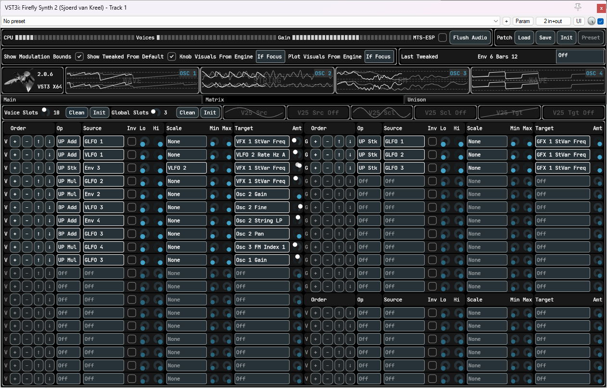

# Legal

<table>
  <tr>
    <td></td>
    <td><a href="https://github.com/free-audio/clap">https://github.com/free-audio/clap</a></td>
    <td></td>
    <td>VST is a trademark of Steinberg Media Technologies GmbH, registered in Europe and other countries.</td>
  </tr>
</table>

# This is not a finished product
* But it is a functioning clap and vst3 plugin.
* Builds and runs on win/lin (ubuntu 22+)/mac (both Intel and ARM).
* Tested on reaper, renoise, fruity and bitwig.
* Osci, inter-osci modulation, envelopes, per-voice and global fx/echo/lfos/modmatrix/audiomixer matrix, global pitchbend/modwheel, voice level (all osci) coarse/fine and portamento implemented.
* Stock JUCE GUI, no presets, no MTS-ESP, no global unison.

# Some demo material
* Bowed strings
[mp3](https://github.com/sjoerdvankreel/firefly-synth-storage/raw/main/firefly-2/render/demo_bowstring.mp3)
[reaper](https://github.com/sjoerdvankreel/firefly-synth-2/raw/main/demo/demo_bowstring.rpp)
[video](https://github.com/sjoerdvankreel/firefly-synth-storage/raw/main/firefly-2/video/demo_bowstring_video.mp4)
* Plucked strings
[mp3](https://github.com/sjoerdvankreel/firefly-synth-storage/raw/main/firefly-2/render/demo_pluckstring.mp3)
[reaper](https://github.com/sjoerdvankreel/firefly-synth-2/raw/main/demo/demo_pluckstring.rpp)
* FM + distortion 1
[mp3](https://github.com/sjoerdvankreel/firefly-synth-storage/raw/main/firefly-2/render/demo_fm_distortion_1.mp3)
[reaper](https://github.com/sjoerdvankreel/firefly-synth-2/raw/main/demo/demo_fm_distortion_1.rpp)
* FM + distortion 2
[mp3](https://github.com/sjoerdvankreel/firefly-synth-storage/raw/main/firefly-2/render/demo_fm_distortion_2.mp3)
[reaper](https://github.com/sjoerdvankreel/firefly-synth-2/raw/main/demo/demo_fm_distortion_2.rpp)
* Distortion (still love it)
[mp3](https://github.com/sjoerdvankreel/firefly-synth-storage/raw/main/firefly-2/render/demo_distortion.mp3)
[reaper](https://github.com/sjoerdvankreel/firefly-synth-2/raw/main/demo/demo_distortion.rpp)
[video](https://github.com/sjoerdvankreel/firefly-synth-storage/raw/main/firefly-2/video/demo_distortion_video.mp4)
* FM + lfo demo
[mp3](https://github.com/sjoerdvankreel/firefly-synth-storage/raw/main/firefly-2/render/demo_fm_lfo_filter.mp3)
[reaper](https://github.com/sjoerdvankreel/firefly-synth-2/raw/main/demo/demo_fm_lfo_filter.rpp)
[video](https://github.com/sjoerdvankreel/firefly-synth-storage/raw/main/firefly-2/video/demo_fm_lfo_filter.mp4)
* GUI Reacting to Bitwig per-voice-modulation demo
[video](https://github.com/sjoerdvankreel/firefly-synth-storage/raw/main/firefly-2/video/demo_bitwig_clap_polymod.mp4)
* Mod matrix demo
[mp3](https://github.com/sjoerdvankreel/firefly-synth-storage/raw/main/firefly-2/render/demo_matrix_pad.mp3)
[reaper](https://github.com/sjoerdvankreel/firefly-synth-2/raw/main/demo/demo_matrix_pad.rpp)
[video](https://github.com/sjoerdvankreel/firefly-synth-storage/raw/main/firefly-2/video/demo_matrix_pad.mp4)
* Mod matrix demo - individual parts of the pad (mp3)
[filter saw](https://github.com/sjoerdvankreel/firefly-synth-storage/raw/main/firefly-2/render/demo_matrix_pad_filter_saw.mp3)
[strings](https://github.com/sjoerdvankreel/firefly-synth-storage/raw/main/firefly-2/render/demo_matrix_pad_strings.mp3)
[fm](https://github.com/sjoerdvankreel/firefly-synth-storage/raw/main/firefly-2/render/demo_matrix_pad_fm.mp3)
[hardsync](https://github.com/sjoerdvankreel/firefly-synth-storage/raw/main/firefly-2/render/demo_matrix_pad_hardsync.mp3)
* Mod matrix demo - individual parts of the pad (reaper)
[filter saw](https://github.com/sjoerdvankreel/firefly-synth-2/raw/main/demo/demo_matrix_pad_filter_saw.rpp)
[strings](https://github.com/sjoerdvankreel/firefly-synth-2/raw/main/demo/demo_matrix_pad_strings.rpp)
[fm](https://github.com/sjoerdvankreel/firefly-synth-2/raw/main/demo/demo_matrix_pad_fm.rpp)
[hardsync](https://github.com/sjoerdvankreel/firefly-synth-2/raw/main/demo/demo_matrix_pad_hardsync.rpp)
* Plucked strings + echo
[mp3](https://github.com/sjoerdvankreel/firefly-synth-storage/raw/main/firefly-2/render/demo_echo_pluckstring.mp3)
[reaper](https://github.com/sjoerdvankreel/firefly-synth-2/raw/main/demo/demo_echo_pluckstring.rpp)
* Saw + echo + echo mod
[mp3](https://github.com/sjoerdvankreel/firefly-synth-storage/raw/main/firefly-2/render/demo_echo_saw_and_echo_mod.mp3)
[reaper](https://github.com/sjoerdvankreel/firefly-synth-2/raw/main/demo/demo_echo_saw_and_echo_mod.rpp)
* FM + echo + echo mod
[mp3](https://github.com/sjoerdvankreel/firefly-synth-storage/raw/main/firefly-2/render/demo_echo_fm_and_echo_mod.mp3)
[reaper](https://github.com/sjoerdvankreel/firefly-synth-2/raw/main/demo/demo_echo_fm_and_echo_mod.rpp)
* Plucked strings + per-voice echo mod
[mp3](https://github.com/sjoerdvankreel/firefly-synth-storage/raw/main/firefly-2/render/demo_voice_echo_pluckstring_and_voice_echo_mod.mp3)
[reaper](https://github.com/sjoerdvankreel/firefly-synth-2/raw/main/demo/demo_voice_echo_pluckstring_and_voice_echo_mod.rpp)

The distortion demo is actually interesting to look at the reaper/video file. It makes use of envelope loop points,
keytracking state variable filters and keytracking comb filters. Because of the keytracking each engine voice
shows up as a different line (frequency response in the filter case, but the same applies to oscis and envelopes)
in the graph plot. See bottom of the page for screenshot.

LFO demo shows plotting of per-voice LFO to gain for the osci.
In case CLAP per-voice modulation is applied too, things get stacked.

# Why yet another one?
There's a couple things i wanted to do that prove difficult to retrofit onto FF1.
This is stuff that has to be built-in from the ground up, which would essentially mean a complete rewrite anyway.
The big ones are 1) make it faster, 2) provide accurate graphs of the per-voice audio engine state, and 3) support clap polyphonic modulation.

* CLAP polymod is important because it is (supposedly, haven't tried yet) a superset of both MIDI MPE and VST3 note expressions. In theory it should be "easy;)" to add MPE support from here.
* Finally bit the bullet and made it SIMD-friendly. Flat structs everywhere, proper alignment, no pointer chasing, and a bit of manual (x)simd where it makes sense.
* Fixed internal block size (16) instead of maximum internal block size (so, PDC). This plays nicely into simd-friendly datastructures.
* Both the audio engine and the GUI keep a copy of the per-voice parameter state to allow accurate reconstruction of the engine state in graphs. Synced each host (not internal) block.
* The actual audio engine state is now a dense buffer per-voice-per-parameter (for per voice params that are automatable/modulatable per sample).
Not the most memory-efficient setup, but easily doable with 16 block size, and makes it really straightforward to do simd stuff.
* Net result so far is something that's ballpark twice as fast (or less slow, if you will ;) and at the same time provides superior visualization.
* I also took the opportunity to fix some other issues with FF1 that did not necessarily warrant a rewrite, but whatever. I got FM wrong (again) in FF1, hard-sync anything just doesn't work, and more.
* And of course, the opportunity to improve upon existing stuff. Keyboard tracking comb filters, pitch modulatable karplus-strong, 
continuous morphing white to pink to brown noise, looping envelopes, and more to come. See below for a more detailed overview of what's new and improved.

# So whats the planning?
* To finish it ;)
* Instead of working in the dark for a year or more i figured, i have something that runs, let's build from here.
* The idea is to do an alpha release per feature. New module (say echo, lfo), midi support, skin the gui, whatever.
* Untill the thing's finally KVR-ready, get it out of alpha, and add non-essential features from there.

# Credits
* Special thanks to Surge Synth Team as always.
* Same soft clippers: https://dafx.de/paper-archive/2012/papers/dafx12_submission_45.pdf.
* Same DSF algorithm: https://www.verklagekasper.de/synths/dsfsynthesis/dsfsynthesis.html.
* Same state variable filter: https://www.cytomic.com/files/dsp/SvfLinearTrapOptimised2.pdf.
* Same (modified) Freeverb: https://github.com/sinshu/freeverb.
* Stole the color-morphing noise algo from here: https://sampo.kapsi.fi/PinkNoise/.
* Stole the new osci algos from here: https://www.taletn.com/reaper/mono_synth/. You have to download the zip to get at the PolyBLEP source for all waveforms.

# Dependencies
- CLAP SDK: [https://github.com/free-audio/clap](https://github.com/free-audio/clap)
- MTS-ESP: [https://github.com/ODDSound/MTS-ESP](https://github.com/ODDSound/MTS-ESP)
- JUCE: [https://github.com/juce-framework/JUCE](https://github.com/juce-framework/JUCE)
- Xsimd: [https://github.com/xtensor-stack/xsimd](https://github.com/xtensor-stack/xsimd)
- Steinberg VST3 SDK: [https://github.com/steinbergmedia/vst3sdk](https://github.com/steinbergmedia/vst3sdk)
- Readerwriterqueue: [https://github.com/cameron314/readerwriterqueue](https://github.com/cameron314/readerwriterqueue)

# The details

## FX
* A single FX slot is optionally oversampled "as a whole".
* A bit like osci, for each FX slot, take your pick of 4 sub-slots.
* All waveshapers have a new bias param to allow for asymmetric shaping.
* 4x choice of wave folder, wave clipper, wave skewer, state var filter, comb filter.
* These are processed in order. AKA "build your own distortion module".
* Keyboard tracking center key with -64 to +64 semis, 0 is C4. Global tracks the last MIDI key.
* For global FX, new smoothing param for incoming last-midi-key. Prevents jumps when keytracking global filters.
* Easy-access mod controls for env/lfo to filter freq/shaper gain.

## Envelope
* 12 stage EG. I guess this classifies as an MSEG, but, no visual editor.
* Per stage amp and slope, per-sample automate/modulate.
* Stage length per-voice-start automate/modulate when not tempo-synced.
* Linear/expo mode, 2 loop points for the sustain stage, any point can be release point, optional tempo sync, optional signal smoothing.

## LFO
* For voice, regular or one-shot.
* For global, regular or snap-to-host-project-time.
* Optional tempo sync and smoothing filter.
* 3x choice of various trig functions, saw/tri/sqr, repeating or free-running random noise or smooth noise, both uniform and gaussian.
* Per-subslot phase offset parameter.
* Per-subslot step function (quantize/stairstep) and continuous rate control.
* Per-subslot choice of add/multiply/stack + continous min/max params.
* For slot A, horizontal and vertical skewing + continous amount params.
* Unlike FF1, free-running smooth noise is now finally actually smooth.

## Osci
* Note: it would be wise to set the osci mod matrix to oversample if you use either the dedicated FM generator or the inter-osci FM mods.
* Comes with unison stereo spread, detune, phase offset, 2 new ones: voice blend and phase offset randomization (gets rid off the phasing effect).
* For "fm" mode, a 3-op FM generator with 3x3 matrix, unit delay on the feedback path, free or rational (0.25 or 1:4) C:M ratios, choice of linear or exponential FM.
* For "wave" mode, get 6 sub-oscis, 2 fixed waveforms, 2 pwm-modulatable waveforms, 1 hardsync-capable waveform, and 1 dsf generator.
* There are loads of new waveforms, see credits below. I stole a bunch of properly BLEP'ed algo's.
* These also include fully BLEP'ed hardsync versions of saw/sqr/tri. These are superior to FF1's hardsync-anything, so hardsync-anything is out.
* Easy access mod controls for env to gain and lfo to fine pitch.
* For "string" mode:
  * Brought back the "frozen noise" from infernal synth.
  * Continous white-to-pink-to-brown noise, uniform or gaussian.
  * Comes with unison stereo spread, detune, voice blend (new unison param).
  * Finally does proper pitch shifting. Accomplished by replacing circular buffer by fractional delay line.
  * This one doubles as a noise osci and string osci. Turn the excite param all the way up for full-on noise.
  * Don't know if this is still karplus-strong, or waveguides, or anywhere in between, or something else. It's different from the one in FF1 in any case.
  * Also new, excite param controls how much new noise to feedback into the delay line (for bowed strings). Optional LPF/HPF for more control of the feedback loop.

## Osci mod matrix
* Oversampling applies to all osci's.
* Inter-osci AM/RM/FM, with (new) exponential FM.
* Like FF1's, but no need to point-and-click, just drag the sliders, because the matrix is already set up.
* All modulations are still per-unison-voice. Make sure the mod source has at least as many uni voices as the target.
* FF1 was actually doing "real" FM instead of PM. That bit me when i was doing feedback FM on the dedicated FM osci, and the pitch went down.

## Voice/global audio mixer matrix (VMIX/GMIX)
* Like FF1's, but no need to point-and-click, just drag the sliders, because the matrix is already set up.
* Easy access mod controls for voice amp/balance and global amp/balance.

## Mod Matrix
* 1 for voice, 1 for global.
* Like FF1, on-note support for voice.
* Much like FF1, select add/mul/stack + bipolar add/mul/stack.
* New Scale parameter which allows the mod amount to be controlled by an additional CV source.
* Single matrix for audio and cv. Env and LFO are now processed in lock-step, so env can modulate LFO and the other way around.
* Env/VLFO/GLFO/Master Aux inputs plus MIDI CC, Pitch Bend, Channel Pressure.

## Echo
* Combined multitap delay / feedback delay / reverb.
* Adjustable ordering of taps / feedback / reverb.
* For per-voice: can only apply to the end of the pipeline (so, after audio mixer (vmix)).
* For global: adjustable placement in the processing pipeline: before all fx, after all fx, after audio mixer, or apply to input / output of any of the effect modules.
* Time or tempo-synced versions of multitap and feedback delay.
* Smoothing parameter for delay time changes. Applies to time, bars, host bpm changes etc etc.
* Unlike FF1, all delay times are now modulatable.
* 8-tap multitap delay with per-tap modulatable level, delay, stereo balance, L/R crossover and resonant LP/HP filters.
* Pop-out matrix editor for the individual taps.
* Feedback delay with modulatable dry/wet mix, delay time, feedback amount, L/R crossover and resonant LP/HP filters.
* Note: reso filters for the feedback delay are placed INSIDE the feedback loop! So that's feedback-filters themselves inside the feedback path of the delay line.
These go out of bounds reasonably fast, so i soft-clip the feedback path at +/- 1000%. But if you get them to sustain at just the sweet spot, you can get some great results.
* (F)Re(e)verb with modulatable dry/wet mix, room size, damping, L/R crossover, all-pass filter control and resonant LP/HP filters.

# Build it
Git clone recursive, build scripts are in /scripts, build_windows|linux|mac.bat|sh Debug|RelWithDebInfo|Release (0|1) (warn as error) (0|1) (enable asan).

# Screenshots

