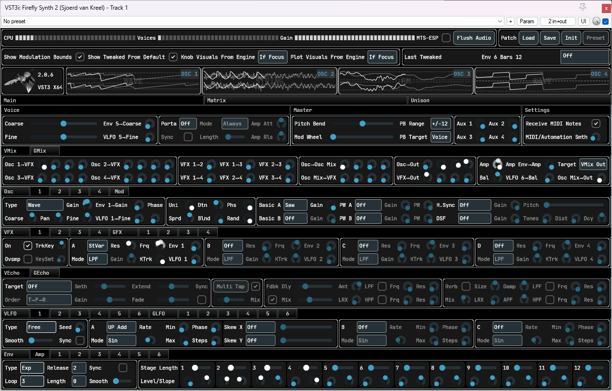
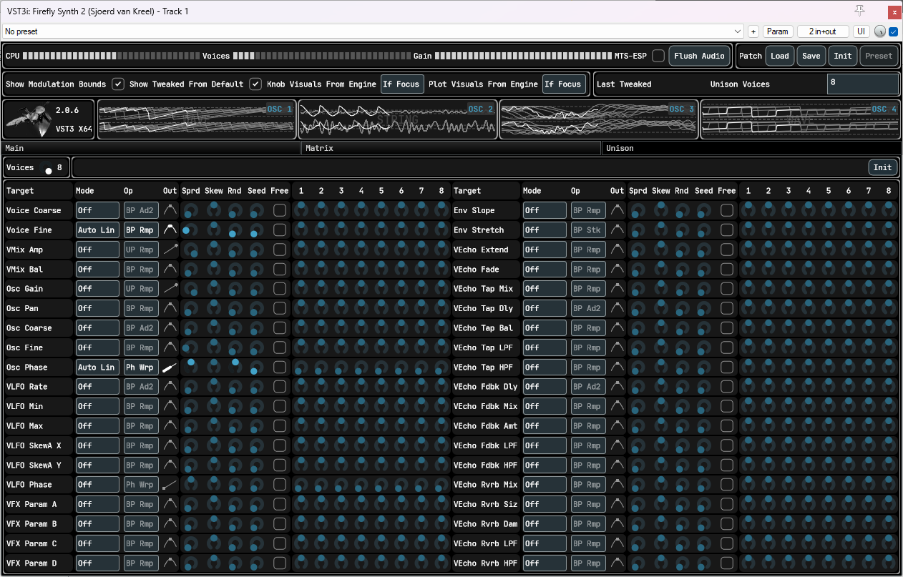

# Nearly ready for V2
Only needs some presets.

Read the [Manual](/static/Manual.md). Click the outline (3 dashes) menu for table-of-contents. 
See [host_test](https://github.com/sjoerdvankreel/firefly-synth-2/tree/main/host_test) for host compatibility tests. 
See [demo](https://github.com/sjoerdvankreel/firefly-synth-2/tree/main/demo) for feature tests, and some nice demos along the way.

# Special Thanks
* [RustoMCSpit](https://github.com/RustoMCSpit) 
For being an early adopter, and helping out with various things on the UI and theming side.
* [Surge Synth Team](https://surge-synth-team.org) 
For help with loads of stuff, from low-level technical details to CLAP support to microtuning and probably more.

# How To Build
* Git clone recursive
* Build scripts are in /scripts: build_windows.bat/build_linux.sh/build_mac.bat
* build_xyz Debug|RelWithDebInfo|Release (0|1):(warn as error) (0|1):(enable asan)

# Host Support
Tested on Carla, Bitwig, Ardour, FLStudio, Reaper and Renoise. 
It should work ok on others as well (f.e. known to work on QTractor). 

Unfortunately Renoise is not officially supported because of 
[https://forum.renoise.com/t/saved-automation-data-does-not-respect-vst3s-parameter-id/68461](https://forum.renoise.com/t/saved-automation-data-does-not-respect-vst3s-parameter-id/68461). 
You can use it as long as you don't update the plugin (read: install once, and never again). 
Updating the plugin might or might not work, but in any case, it's dangerous. 

# Dependencies
- CLAP SDK: [https://github.com/free-audio/clap](https://github.com/free-audio/clap)
- MTS-ESP: [https://github.com/ODDSound/MTS-ESP](https://github.com/ODDSound/MTS-ESP)
- JUCE: [https://github.com/juce-framework/JUCE](https://github.com/juce-framework/JUCE)
- Xsimd: [https://github.com/xtensor-stack/xsimd](https://github.com/xtensor-stack/xsimd)
- Steinberg VST3 SDK: [https://github.com/steinbergmedia/vst3sdk](https://github.com/steinbergmedia/vst3sdk)
- Readerwriterqueue: [https://github.com/cameron314/readerwriterqueue](https://github.com/cameron314/readerwriterqueue)

# Credits
* Same soft clippers: https://dafx.de/paper-archive/2012/papers/dafx12_submission_45.pdf.
* Same DSF algorithm: https://www.verklagekasper.de/synths/dsfsynthesis/dsfsynthesis.html.
* Same state variable filter: https://www.cytomic.com/files/dsp/SvfLinearTrapOptimised2.pdf.
* Same (modified) Freeverb: https://github.com/sinshu/freeverb.
* Stole the color-morphing noise algo from here: https://sampo.kapsi.fi/PinkNoise/.
* Stole the new osci algos from here: https://www.taletn.com/reaper/mono_synth/. You have to download the zip to get at the PolyBLEP source for all waveforms.
* Smooth noise: https://www.scratchapixel.com/lessons/procedural-generation-virtual-worlds/procedural-patterns-noise-part-1/creating-simple-1D-noise.html

# Demo Material
* Bowed strings
[mp3](https://github.com/sjoerdvankreel/firefly-synth-storage/raw/main/firefly-2/render/demo_bowstring.mp3)
[reaper](https://github.com/sjoerdvankreel/firefly-synth-2/raw/main/demo/demo_bowstring.rpp)
[video](https://github.com/sjoerdvankreel/firefly-synth-storage/raw/main/firefly-2/video/demo_bowstring_video.mp4)
* Plucked strings
[mp3](https://github.com/sjoerdvankreel/firefly-synth-storage/raw/main/firefly-2/render/demo_pluckstring.mp3)
[reaper](https://github.com/sjoerdvankreel/firefly-synth-2/raw/main/demo/demo_pluckstring.rpp)
* FM + distortion 1
[mp3](https://github.com/sjoerdvankreel/firefly-synth-storage/raw/main/firefly-2/render/demo_fm_distortion_1.mp3)
[reaper](https://github.com/sjoerdvankreel/firefly-synth-2/raw/main/demo/demo_fm_distortion_1.rpp)
* FM + distortion 2
[mp3](https://github.com/sjoerdvankreel/firefly-synth-storage/raw/main/firefly-2/render/demo_fm_distortion_2.mp3)
[reaper](https://github.com/sjoerdvankreel/firefly-synth-2/raw/main/demo/demo_fm_distortion_2.rpp)
* Distortion (still love it)
[mp3](https://github.com/sjoerdvankreel/firefly-synth-storage/raw/main/firefly-2/render/demo_distortion.mp3)
[reaper](https://github.com/sjoerdvankreel/firefly-synth-2/raw/main/demo/demo_distortion.rpp)
[video](https://github.com/sjoerdvankreel/firefly-synth-storage/raw/main/firefly-2/video/demo_distortion_video.mp4)
* FM + lfo demo
[mp3](https://github.com/sjoerdvankreel/firefly-synth-storage/raw/main/firefly-2/render/demo_fm_lfo_filter.mp3)
[reaper](https://github.com/sjoerdvankreel/firefly-synth-2/raw/main/demo/demo_fm_lfo_filter.rpp)
[video](https://github.com/sjoerdvankreel/firefly-synth-storage/raw/main/firefly-2/video/demo_fm_lfo_filter.mp4)
* GUI Reacting to Bitwig per-voice-modulation demo
[video](https://github.com/sjoerdvankreel/firefly-synth-storage/raw/main/firefly-2/video/demo_bitwig_clap_polymod.mp4)
* Mod matrix demo
[mp3](https://github.com/sjoerdvankreel/firefly-synth-storage/raw/main/firefly-2/render/demo_matrix_pad.mp3)
[reaper](https://github.com/sjoerdvankreel/firefly-synth-2/raw/main/demo/demo_matrix_pad.rpp)
[video](https://github.com/sjoerdvankreel/firefly-synth-storage/raw/main/firefly-2/video/demo_matrix_pad.mp4)
* Mod matrix demo - individual parts of the pad (mp3)
[filter saw](https://github.com/sjoerdvankreel/firefly-synth-storage/raw/main/firefly-2/render/demo_matrix_pad_filter_saw.mp3)
[strings](https://github.com/sjoerdvankreel/firefly-synth-storage/raw/main/firefly-2/render/demo_matrix_pad_strings.mp3)
[fm](https://github.com/sjoerdvankreel/firefly-synth-storage/raw/main/firefly-2/render/demo_matrix_pad_fm.mp3)
[hardsync](https://github.com/sjoerdvankreel/firefly-synth-storage/raw/main/firefly-2/render/demo_matrix_pad_hardsync.mp3)
* Mod matrix demo - individual parts of the pad (reaper)
[filter saw](https://github.com/sjoerdvankreel/firefly-synth-2/raw/main/demo/demo_matrix_pad_filter_saw.rpp)
[strings](https://github.com/sjoerdvankreel/firefly-synth-2/raw/main/demo/demo_matrix_pad_strings.rpp)
[fm](https://github.com/sjoerdvankreel/firefly-synth-2/raw/main/demo/demo_matrix_pad_fm.rpp)
[hardsync](https://github.com/sjoerdvankreel/firefly-synth-2/raw/main/demo/demo_matrix_pad_hardsync.rpp)
* Plucked strings + echo
[mp3](https://github.com/sjoerdvankreel/firefly-synth-storage/raw/main/firefly-2/render/demo_echo_pluckstring.mp3)
[reaper](https://github.com/sjoerdvankreel/firefly-synth-2/raw/main/demo/demo_echo_pluckstring.rpp)
* Saw + echo + echo mod
[mp3](https://github.com/sjoerdvankreel/firefly-synth-storage/raw/main/firefly-2/render/demo_echo_saw_and_echo_mod.mp3)
[reaper](https://github.com/sjoerdvankreel/firefly-synth-2/raw/main/demo/demo_echo_saw_and_echo_mod.rpp)
* FM + echo + echo mod
[mp3](https://github.com/sjoerdvankreel/firefly-synth-storage/raw/main/firefly-2/render/demo_echo_fm_and_echo_mod.mp3)
[reaper](https://github.com/sjoerdvankreel/firefly-synth-2/raw/main/demo/demo_echo_fm_and_echo_mod.rpp)
* Plucked strings + per-voice echo mod
[mp3](https://github.com/sjoerdvankreel/firefly-synth-storage/raw/main/firefly-2/render/demo_voice_echo_pluckstring_and_voice_echo_mod.mp3)
[reaper](https://github.com/sjoerdvankreel/firefly-synth-2/raw/main/demo/demo_voice_echo_pluckstring_and_voice_echo_mod.rpp)
* Per-voice echo applied to only one out of 2 osci's
[mp3](https://github.com/sjoerdvankreel/firefly-synth-storage/raw/main/firefly-2/render/demo_voice_echo_one_osci_only.mp3)
[reaper](https://github.com/sjoerdvankreel/firefly-synth-2/raw/main/demo/demo_voice_echo_one_osci_only.rpp)
* Global unison with different per-voice settings for coarse pitch, voice lfo to voice filter, and echo
[mp3](https://github.com/sjoerdvankreel/firefly-synth-storage/raw/main/firefly-2/render/demo_global_uni_lfo_echo.mp3)
[reaper](https://github.com/sjoerdvankreel/firefly-synth-2/raw/main/demo/demo_global_uni_lfo_echo.rpp)

# Legal
<table>
  <tr>
    <td></td>
    <td><a href="https://github.com/free-audio/clap">https://github.com/free-audio/clap</a></td>
    <td></td>
    <td>VST is a trademark of Steinberg Media Technologies GmbH, registered in Europe and other countries.</td>
  </tr>
</table>

# Screenshots

