# CLAP vs VST3 build
If possible, prefer the CLAP version even if not using the CLAP host modulation feature. 
Some hosts (especially but not only) on Linux have troubles with the realtime audio engine visualization for the VST3 build. 
Other than that both are pretty much equal, there's no performance advantages for one over the other. 
In particular, FF2 does not make use of CLAP's threadpool feature. 

FF2 fully supports CLAP's modulation feature including per-voice (polyphonic) modulation. 
Patches can be shared between the VST3 and CLAP builds.

# Instrument vs FX build
The only real differences are:
* One presents to the host as an instrument, the other as an effect.
* Instrument advertises audio input as aux in, fx advertises audio input as main in.

Some hosts make a big fuss about these distictions, some do not. 
Some hosts allow to send midi notes to an FX plugin, some do not. 

All the rest is really just different default values:
* Receive MIDI notes: default Off for FX, On for instrument.
* Global echo target defaults to External Audio for FX, off for instrument.
* Global mixer default routes External Audio to master out for FX, Voice Mixdown to master our for instrument.

Patches can be shared between the FX and instrument builds.

# GUI Top section
Contains everything that is not directly related to generating audio.

## Output panel
Shows CPU usage relative to single core, voice usage and output gain with a maximum of 0dB. 
The MTS-ESP indicator shows whether an MTS-ESP master is connected.

## Panic button
Kills all active voices and flushes delay lines. 
Comes in handy for stuck notes or when you managed to fill the delay lines with garbage.

## Patch panel
Shows the name of the last loaded patch. 
Comes with regular load-from/save-to-file, init patch to defaults, and load factory preset options, as well as:

* Session: revert the patch state to the time the DAW session was loaded.
* Reload: revert the patch state to the last time a patch was loaded from file, preset, or default values (init patch).

## GUI settings
* Show modulation bounds: 
Highlights the minimum and maximum values currently applied to a parameter by the mod matrix and direct modulators.
* Show tweaked from: 
Highlights the parameters that differ from either default values, last loaded DAW session state, or last loaded patch state.
* Knob visuals from engine: 
Highlights a parameters current audio engine state. 
For per-voice parameters, takes into account the minimum and maximum values across all voices.
* Plot visuals from engine: 
Draws the current state of the audio engine into the graph plots, taking all modulation into account. 
For per-voice modules, this is an additional line per voice. 
When off, graph plots reflect only the current state of the parameters as shown in the GUI.

## Last tweaked
Shows the name of the last tweaked parameter as well as a textbox that allows for precise-editing that parameters value.

## Graph plots
Shows a plot of the last tweaked module. 
For example this can be an oscilloscope, filter frequency response, waveshaper response or others, depending on the module being shown.

# Modules

All modules are contained within the Main tab. 
This is the primary screen for patch design. 
It contains all parameters for oscillators, filters, effects, envelopes and LFOs as well as all audio routing controls and high-level parameters like microtuning and portamento controls.

## Voice
Contains controls affecting an entire voice (all per-voice oscillators and filters).

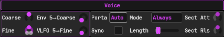

Pitch section: coarse pitch with envelope modulation amount and fine pitch with LFO modulation amount. 
Portamento section: allows selection of regular (on) mode (constant pitch, variable time) or automatic mode (constant time, variable pitch) and optional tempo-syncing. 

Because FF2 does not provide monophonic mode, the portamento controls also come with the option to shorten the per-voice amp envelope attack and release sections.
Best illustrated with an example:
* Set portamento mode to "Section"
* Set both Amp Attack and Amp Release to 25%
* Play A-B-C-[pause]-D-E-F
* Attack time of A and D is normal.
* Release time of C and F is normal.
* Attack times of B, C, E, and F are shortened.
* Release times of A, B, D, and E are shortened.

This feature works strictly by tracking note-on/off events. 
Section "shortening" will kick in only for overlapping notes, or notes that are both triggered and released at the exact same time.

### CV Outputs
* Fine Pitch Raw (control signal value 0..1)

Pitchtracking sources (see Modulation System):
* Fine Pitch (does not track microtuning)
* Coarse Pitch (does not track microtuning)
* Portamento Offset (does not track microtuning)
* Voice Pitch (tracks voice key, fine/coarse pitch, portamento, master PB and microtuning)

## Master
Contains controls affecting the plugin as a whole. 
These parameters control all voices together as well as affect global filters and effects.

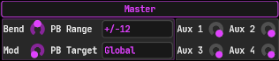

Pitchbend together with bend range sets the base pitch for the entire plugin. 
By default it is set to control everything, but it can also target specific oscillators. 
By default, MIDI pitchbend is set to modulate master pitchbend at full scale, but this can be changed in the mod matrix.

Likewise, modwheel is by default modulated by MIDI modwheel at full scale by the matrix. 
Modwheel doesn't control anything unless you set up the matrix to do so.

There are 4 auxiliary parameters which also don't target anything by default. 
Use the mod matrix to assign modulation targets to them. 
This is useful for controlling the mod amount of other sources or controlling multiple parameters at once.

### CV Outputs
* Modwheel
* 4x Auxiliary control
* Pitch Bend Raw (control signal value 0..1)

Pitchtracking sources (see Modulation System):
* Pitch Bend (adjusted for Bend Range, does NOT track microtuning)
* Last/Low/High Key Pitch and Low/High Velocity Pitch + smoothed versions (react to Settings MIDI/Automation smoothing): 
These DO track microtuning and include the PB component as well.

## Settings
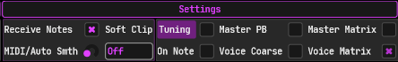

Receive MIDI notes controls whether the plugin kicks off a new voice on incoming midi note on messages. 
This is enabled by default for the instrument version of the plug and disabled by default for the fx version. 
Some hosts allow to send midi notes to an fx plugin, others do not. 
If possible, you can do nice things like keyboard tracking global filters in the fx build.

"Receive MIDI notes" is a bit of a misnomer. 
The plugin receives any note the host sends to it. 
In the global matrix source, Last/Low/High Key etc will just work, even with Receive Notes disabled. 

The MIDI and automation smoothing control parameter can be used to smooth sudden changes in incoming MIDI and automation events. 
This parameter affects CLAP modulation events as well.

Microtuning controls: 
These allow some control over what settings that make up the pitch are applied in the tuned or untuned parts of pitch calculation. 
Incoming MIDI notes are always part of the retuned pitch.

* Tuning: 
When on, enables microtuning. 
Requires an MTS-ESP master to be connected.
* Tune On Note: 
When on, microtuning is applied at incoming MIDI. 
When off, microtuning is applied continuously. 
When on, the "tune master pitchbend" switch has no effect for voice-level tuning, but it does still affect the master pitch sources in the global mod matrix.
* Master pitch bend: 
Includes master PB in either the tuned or untuned part of pitch calculations. 
When off, setting master PB to +12 semis results in 1 octave up (so, double the frequency). 
When on, and master PB is set to +12 semis, playing C4 results in the exact same pitch as playing C5 with microtuning enabled (and master PB set to 0).
* Voice coarse: 
Includes voice coarse pitch parameter in either the tuned or untuned part of pitch calculations. 
This is primarily intended to cooperate with global unison, which can alter the coarse pitch of individual voices.
* Tune master matrix/tune voice matrix: 
These affect whether voice-level pitch and global last/low/high-key pitch sources in the matrix are retuned. 
See the matrix section for more details.

## Voice mixer
Controls the signal path of the per-voice audio engine.

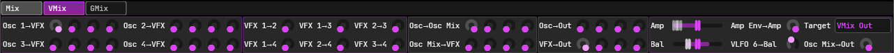

* Oscillator to voice FX: 
Routes the output of individual oscillators to the per-voice effect (VFX) section.
* Voice FX to voice FX: 
Routes the output of per-voice effect modules to other per-voice effect modules. 
FX modules are processed in order, so you can only route VFX 1 to 2/3/4, 2 to 3/4 etc.
* Oscillator mix: 
This is an internal intermediate stage that combines the output of all oscillators. 
You can control how much each osci contributes to oscillator mix, and then route the combined mix to each of the VFX modules.
* Oscillator to out: 
Directly routes individual oscis to voice output. 
If you use this in combination with osci to oscillator mix, an osci output will be added to the voice signal twice.
* VFX to out: 
Directly routes individual voice-level FX to voice output. 
If you use this in combination with oscillator mix to VFX, an effect output will be added to the voice signal twice.

The amplitude parameter controls the voice level as a whole. 
Amp env to amp controls how much the per-voice amplitude envelope affects this parameter. 
By default this is set to 100% so the entire voice just follows the voice amp envelope. 
You can set it to 0% and have the voice play at full scale regardless of the voice amp envelope. 
This is useful if you want to assign different envelopes to individual oscis. 
In any case the voice amp envelope still controls voice lifetime - when it's done, the voice is killed, 
regardless of any other potentially still active envelopes.

Voice amplitude envelope target: this controls at which stage the voice amp envelope is applied. 
The most natural setting for this is "VMix Out", but it can be set to individual oscillators, osci mix, or individual FX as well. 
The primary use case for this is to cooperate with per-voice echo. Per-voice echo can be applied to the voice as a whole, 
but also to individual oscis and FX. In which case, it is necessary to change the target accordingly, to prevent the voice echo 
from being cut short by the voice amplitude envelope. See the Voice Echo section and the routing overview for more details.

Balance control: this is just a straightforward stereo balancer with an optional LFO applied to it. 
Osc mix to out: controls how much the internal osci mixer stage contributes to the final voice output.

## Global mixer
Controls the signal path of the global audio engine.

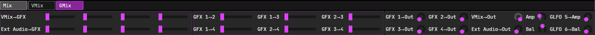

* Voice Mix to GFX: 
Routes the voice mixdown to the global effect (GFX) section.
* External Audio to GFX: 
Routes external audio to the global effect (GFX) section. 
For the FX build, external audio is the plugin's primary input. 
For the instrument build, external audio is the plugin's sidechain input.
* Global FX to global FX: 
Routes the output of global effect modules to other global effect modules. 
FX modules are processed in order, so you can only route GFX 1 to 2/3/4, 2 to 3/4 etc.
* GFX to out: 
Routes individual global FX to master output.
* VMix to out: 
Routes voice mixdown to master output.
* External audio to out: 
Routes external audio to master output.

The amplitude parameter is just master gain with an optional LFO applied to it. 
Likewise the balance control is global stereo balance with an optional LFO applied to it.

## Oscillator

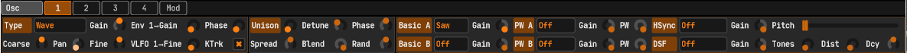

The graph plot for oscillators is an oscilloscope. 
For engine visualization, plots higher notes (relative to C4) as shorter and lower notes as longer.

### Main section
Contains controls common to all oscillator types.

Oscillator type:
* String: combined string/noise osci.
* FM: 3-op FM generator with 3x3 matrix.
* Wave: sine, saw, sqr etc, couple of PWM-capable algorithms, some hard-sync capable algoritms and a DSF generator.
* External Audio: use audio in as an oscillator to allow it as an FM/AM/RM source in the inter-osci modulation section.

Comes with gain control plus optional envelope, fine pitch control plus optional LFO (vibrato), phase offset and coarse pitch controls.
Panning: an osci is inherently monophonic unless you turn on the osci-level unison feature.
Pan control may be used to pan hard-left/hard-right or anything in between. 

Keyboard tracking: by default an oscillator's base pitch (so not counting coarse/fine offset and unison detune) follows the voice's base pitch.
The voice base pitch is basically the incoming MIDI note with pitch bend, voice-level coarse/fine offset, portamento and microtuning applied.
If you turn off keyboard tracking the oscillator base pitch becomes C0.
You can then use the the osci-level coarse and fine pitch controls to affect the osci pitch. 

By itself this gives you a constant pitch, so not really useful.
Instead, this feature is meant to allow building up the osci pitch by the matrix.
You can stack individual components like voice key, pitch bend, portamento offset, voice coarse/fine offset to the osci's coarse pitch to build up the corresponding voice pitch by hand.
This opens up some neat possibilities like leaving out specific pitch components (like PB) for a single osci only, or f.e. to invert the effect of the portamento. 

There is one caveat: if you use microtuning you cannot accurately build up the voice pitch from individual components.
If you want to have a non-tracking oscillator and play it microtuning-aware, you have to use the unified "Voice Pitch" matrix source.
This source combines everything that affects voice-level pitch and then applies microtuning to the final result.
Rationale: i don't know how to individually microtune PB, voice coarse offset, portamento etc and still have the result come out "correct",
i.e., equal to the result of tuning them all together at once. Don't even know if it's possible or not.

### Unison section
Controls osci-level unison.

These controls apply to all oscillator types:
* Voice count: how often to calculate the osci with the different settings applied, and add it to the output signal. 
* Blend: this gradually decays the unison voice level as it moves away from center position. 
If you don't have a center position (so, even voice count) setting this to zero produces silence.
* Stereo spread: spreads out the unison voices from hard-left to hard-right.

For External Audio, the blend and spread controls don't really do much. 
You can hear the effect of the blend parameter as a change in amplitude only. 
The spread parameter "does something" but you basically cannot hear it as each subvoice is exactly the same, so, it doesn't matter where it is positioned in the stereo spectrum.

Unison detune applies to all oscillator types except External Audio. 
It controls the fine pitch offset relative to center position (so, with odd voice count, center voice has no offset).

Phase offset and phase offset randomization apply to Wave and FM mode only. 
With zero phase offset, the unison output will have a harsh attack to it as all subvoices are initially the same. 
With 100% phase offset, the unison output produces more of a string-like sound but still with a very distinctive phasing effect. 
Use the phase offset randomization control to produce a more natural sound.

### Wave section

6 sub-slots per oscillator slot. Take your pick of: 
* 2x basic waveform with nothing but a gain control: 
Includes all the common ones like sin, cos, saw, sqr, tri as well as a bunch of more esoteric waveforms.
* 2x pulse-width-modulatable waveform with gain control and PWM control: 
Classic square-to-pulse, triangle-to-saw and a couple others.
* 1x hard-sync capable waveform: 
Choice of saw/sqr/tri. Pitch controls the offset of slave pitch relative to the osci's internal/master pitch.
* 1x DSF generator (additive oscillator with just a couple control parameters): 
Distance (specified in times the osci frequency) and decay control the frequency and amplitude of consecutive sines. 
Overtones mode allows to explicitly specify the number of sines generated. 
Bandwidth mode allows to specify a range between base frequency only (0%) or all the way up to Nyquist/half-sample-rate (100%). 

The DSF generator is based on [https://www.verklagekasper.de/synths/dsfsynthesis/dsfsynthesis.html](https://www.verklagekasper.de/synths/dsfsynthesis/dsfsynthesis.html). 
All others can be found in the polyblep section over here [https://www.taletn.com/reaper/mono_synth](https://www.taletn.com/reaper/mono_synth).

### FM section

This is a dedicated FM-generator with 3 operators and a 3x3 matrix with unit delay on the feedback path. 
Since FM produces a "wide" signal (frequency wise) it's quite easy to cause aliasing with it. 
Should this happen, you'll need to turn on oversampling in the inter-osci modulation section. 
Even though that's called "osci mod", turning on oversampling there will oversample each oscillator 
whether it is modulated by another osci or not. Even with oversampling on, there's no guarantee you won't go "out of bounds", but it helps.

The mode control switches between regular (linear) FM and exponential FM. 
In the linear case the modulator affects the phase of the carrier (so yeah it's PM really, like everyone else does it). 
In the exponential case the modulator affects the pitch of the carrier. 
Exponential FM can produce some really deep sounds but it also "shifts" the pitch, so you need to get it back in tune somehow.

Ratio mode: allows to specify the carrier/modulator ratio as either free-form/continuous or rational (1:2, 2:3, 3:4 etc). 
Operator 1 is implicitly defined as "1", and you can select op2:op1 and op3:op2 on top of that. 
So, set both to 2:1, then op3:op1 will be 4:1. Either 4 times the pitch or 4 times the frequency, depending on the mode. 
FM Index: this controls how much of the modulator signal to add to the phase (linear) or pitch (exponential) of the carrier.

### String section

This is a combined noise/string generator. 
It can be used to generate plucked strings, bowed strings, and colored noise. 
In its default configuration it generates a plucked string by some variation of the extended Karplus-Strong algorithm. 
(Or at least i think so. It's actually backed by a fractional delay line instead of a ringbuffer to allow continuous pitch shifting). 
Turn up the excite parameter just a little bit (and tweak some other controls) to get a bowed string. 
Turn up the excite parameter all the way to generate full-on noise. 
Colored noise generation is based on [https://sampo.kapsi.fi/PinkNoise](https://sampo.kapsi.fi/PinkNoise).

* Mode: selects uniform or gaussian distribution for the backing random generator. 
Gaussian sounds more natural as the corresponding distribution is a bell curve instead of rectangular. 
Uniform generates more frequency content, so sounds brighter.
* Excite: controls the level of new noise to generate and feed back into the delay line at each sample. 
At 0%, the osci decays into Karplus-Strong and the damping and feedback controls solely control the sound lifetime. 
At 100%, the oscillator turns into a noise generator. 
In between, you can get bowed strings, but this requires some cooperation with other controls as well. 
In particular the voice amplitude envelope.
* Seed: random seed for the backing random generator.
* Tracking key: root key (relative to C4) for keyboard tracking the damping, feedback, and filter controls.
* Color: continuous color control from brown to pink to white noise.
* Color quality: selects the stage count of the color filter.
* X/Y: freeze (sample and hold) the signal in either the time or amplitude dimension. 
With color to full-on white noise and damping to zero this pretty much replicates the noise osci from infernal synth.

Filter controls: 
The plugin is set up such that the filter controls affect all of the initial excitation,  
the damping factor, and on the feedback path, the feedback factor and the re-excite amount. 
Contains both an LP and HP filter with frequency and resonance controls and keyboard tracking amount relative to the root key.

Damping is primarily used to shorten low notes. 
Feedback is primarily used to lengthen high notes. 
Both of them can be keyboard-tracked relative to the root key.

### External Audio Section

Allows to use external audio input as an oscillator. 
Primary use case is to allow an external signal as an FM/RM/PM source. 
If you just want to throw some effects to external input, use Global Mixer ("External Audio To GFX") and the global echo module instead.

* Input gain for when the external signal is too loud/too quiet.
* Balance control to turn the external stereo signal into mono. 
FF2 does not support true stereo oscillators before the unison stage.
* Built-in low/highpass filters for additional control.

## Oscillator Oversampling and Cross-modulation

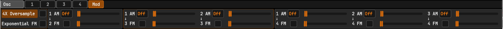

Each oscillator can modulate all those after it. 
So, 1 can modulate 2/3/4, 2 can modulate 2/3 and 3 can modulate 4.

* Oversampling: 
Enables 4x oversampling for all oscis. 
FF2 does not allow oversampling oscillators on an individual basis (precisely because of the cross-modulation feature). 
* Exponential FM: 
Linear FM (off) is the default, modulator controls the carrier's phase. 
Exponential (on): modulator controls the carriers pitch. Causes pitch-drift.
* AM/RM: controls amplitude or ring modulation with continuous amount.
* FM: controls frequency modulation (either PM or exponential) with continuous FM index.

## Voice FX and Global FX
Effect module with 4 subslots, each slot can be a state variable filter, comb filter, or waveshaper.

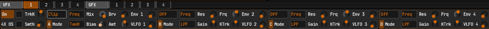

Oversampling applies to the module as a whole, so all 4 subslots together. 
Tracking key sets the root key (offset from C4) against which all filters are keyboard-tracked. 
Keytracking happens against the voice-triggered note for voice level FX, and last triggered note for global FX 
(unless in no-pitch-tracking mode, see below). 
For global FX only, the key smoothing control allows to smooth out changes in the last received MIDI key.

The graph plot for waveshapers is a shaper plot. 
The graph plot for filters is a frequency response. 
The graph plot for everything combined is a ramp response. 

### Filter modes
Both SV filters and comb filters can be used in frequency mode, pitch mode or pitch-tracking mode.
* For frequency mode (regular) you can specify the filter cutoff in Hz. 
Keyboard tracking is done against the difference between base pitch and root key. 
With 100% keytracking, the filter frequency doubles as base pitch goes up one octave from the tracking root.
* For tracking pitch mode, the base pitch tracks the voice pitch and you set an additional coarse pitch as an offset from that. 
For example, play C4-C5, the filter frequency will be 261-523 Hz. 
Keyboard tracking is also done against the difference between base pitch and root key. 
* For raw pitch mode, the base pitch is C0 and you can specify the filter cutoff in semitones (so coarse:60 is 261 Hz). 
With 100% keytracking, the filter frequency doubles as the coarse parameter itself goes one octave up from the tracking root. 
Raw pitch mode can be used to build up the filter frequency from the matrix, just like for non-tracking oscillators.

Both pitch modes can be used to have high-resonance filters play in tune with the oscillators. 
Just like with oscillators, if you want non-pitch-tracking filters to be properly microtuned, 
you have to use the dedicated/unified pitch tracking matrix sources ("Voice Pitch" and "Master Last/Low/High Pitch").

### Envelope and LFO modulators
For SV filters these affect the frequency and pitch controls. 
For comb filters these affect both the feedback and feedforward frequency and pitch controls. 
For all shaper types, affect the Drive parameter.

### State variable filter
This is FF2's implementation of the filters found over here: 
[https://www.cytomic.com/files/dsp/SvfLinearTrapOptimised2.pdf](https://www.cytomic.com/files/dsp/SvfLinearTrapOptimised2.pdf). 
Comes in 9 flavors: lowpass, highpass, bandpass, bandstop, allpass, peaking, bell (with gain control) and low/high shelf with shelving gain.

### Comb filter
Choice of feedback, feed-forward or both. 
Comb filters are now specified in Hz (or pitch) instead of milliseconds like FF1.

### Waveshaper
All waveshapers have these common parameters:
* Bias: offsets the input signal level.
* Drive: multiplies the input signal after bias.
* Dry/wet mix: controls the input/output signal ratio.

Clip: forces the signal into -100..100%. Below -100% comes out as -100% and input above 100% comes out as 100%. 
All clippers except for hard clip are implemented from 
[https://dafx.de/paper-archive/2012/papers/dafx12_submission_45.pdf](https://dafx.de/paper-archive/2012/papers/dafx12_submission_45.pdf). 
The exponential clipper has an additional amount control.

Fold: like clip, forces the signal into -100..100%, but instead of limiting the signal, will fold back into range. 
Choice of a plain (triangular) folder and a bunch of (stacked) trigonometric functions like sine(in), cosine(in), sine(in + sine(in)), sine(in + cosine(in)) etc.

Skew: applies a vertical (y/level) skewing factor to the signal. 
Choice of unipolar and bipolar modes with continuous amount control.

## Voice Echo and Global Echo

Echo module with multitap delay, feedback delay and reverb subslots. 
There is at most one of each, but the processing order is customizable. 
The graph plot for echo is a ramp response with a slight delay in the right channel.

All subslots have these common controls:
* On/off switch
* Dry/wet control
* Stereo crossover: 
Each echo type has a control labelled LRX for left/right crossover. 
This controls the amount by which one channel's input affects the other channel's output. 

### Main section
* Gain: make-up gain to compensate dry/wet mixes.
* Processing order: allows to route multi-tap, feedback delay and reverb in any order.
* Sync: switches between time-based and tempo-based (bars) for feedback and multi-tap.
* Smooth: delay time smoothing filter for feedback and multi-tap.

Target: this affects where in the processing pipeline the echo is applied. 
The most natural setting for this is VMix Out (voice) or GMix Out (global). 
For global, may also be used to target the voice mixdown before all FX, 
the external audio input before all fx, or the input/output of individual GFX sections. 
For voice, may also be used to target individual oscillators or the input/output of individual VFX sections. 
This allows for stuff like "filter/shape the echo" instead of "echo the filter/shaper". 
Or echo individual oscis.

The voice echo target needs tight cooperation with the Voice Mixer (VMix) envelope target. 
If you get this wrong, the voice echo will "hide" behind that envelope and the echo is cut short. 
Rule of thumb: set VEcho target to the same processing stage, or later, as VMix Envelope Target. 
So both to osci premix/postmix, fx in/out etc. 
The engine is set up such that at each stage, the voice envelope is applied first, 
followed by the echo (provided they target the same stage). 
See the routing overview for more details.

### Per-voice echo specific
It's expensive both cpu and memory wise. 
The echo actually "lives within the voice itself".

On the memory side, it needs (multiple) delay lines per voice. 
These are only allocated when you turn on the feature. 
This is not realtime safe unless the daw session was already loaded with VEcho enabled, in which case things are pre-allocated.

On the CPU side, it extends the voice lifetime to allow the echo to play out. 
This will add (user controllable, up to) 10 seconds (or way more when tempo-synced) to the voice lifetime. 
So your 500 millisecond voice (by voice amp envelope) gets extended by that much, and voice count will drastically go up.

* Voice Extend Time lengthens the life of the voice at full scale by up to 5 seconds.
* Voice Fade Time lengthens the life of the voice, on top of extend time, by linear fade-out up to an additional 5 seconds.

"Full scale" and "linear fadeout" here mean after the voice amplitude envelope is already applied. 
So, when your oscis hit silence (by voice envelope), allows another 5 seconds of full scale echo followed by 5 seconds of fade-out echo.

### Multi tap delay
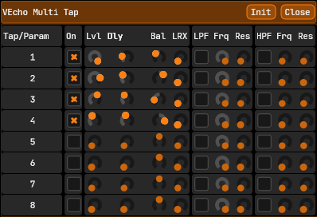

* 8-tap delay line with full control over each taps individual parameters.
* Per-tap delay time (or bars), level, stereo balance and stereo crossover.
* Optional per-tap low and highpass filters on the output.

### Feedback delay
Feedback delay line with time/bars control and feedback amount. 
Comes with an internal LFO (Mod Rate/Mod Amount controls) that affect the delay time. 
This works both for when the delay time is specified in seconds or in bars 
(unlike a matrix-based solution. Also possible, but doesn't work for the tempo-synced case). 

You can optionally enable both a low and a highpass filter. 
Unlike for the multitap and reverb slots, these filters are not applied to the output signal. 
Instead for the feedback delay, filters are placed on the feedback path. 
This allows for some interesting effects but it's also a great way to blow up the delay line with high-resonant filters. 
Which again is a great usecase for the panic button. 
If you need filters applied to the output of the feedback delay instead, 
you'll have to position (Target) the echo module to somewhere before an FX module.

### Reverb
Implementation based on [https://github.com/sinshu/freeverb](https://github.com/sinshu/freeverb).
* Room size, damping factor and allpass filter controls.
* Optional low and highpass filters on the output.

## Voice LFO and Global LFO
LFO module with 3 subslots and optional tempo-syncing.

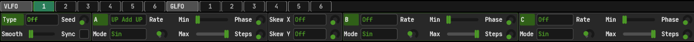

The LFO output is that of the 3 slots combined. 
The individual slot outputs are also available as sources in the mod matrix.

The graph plot for LFO subslots are 1 cycle of each. 
The graph plot for LFO final output are all subslots combined and smoothed, but with length determined by slot A. 
In free-running random mode, the audio engine visualization decays to a flat line (per voice for VLFO). 
I found it too complicated to "calculate back" the LFO state from origin in that case. 
For periodic modes, the audio engine visualization is just a dot moving along the plot line.

The 3 subslots are stacked one after another. 
You can control the manner in which this happens by changing the operator parameter. 
See Modulation System for details about the operator types. 
For example, add slot B to slot A, multiply slot A by slot B, etc. 
LFOs are intrinsically unipolar and have an implicit "base" stage of zero/silence. 
So, if you set slot A to multiply, the entire LFO becomes silence. 
Note that the mod matrix allows any signal to be treated as unipolar or bipolar regardless. 
All 3 subslots are basically the same except for some skewing parameters on slot A.

### Main section
* Sync: switches between time-based and tempo-based (bars).
* Seed: random seed for the backing random generators of noise-based LFOs.
* Smooth: this is a smoothing filter applied to the final output only. 
Does not affect the individual subslots.
* Voice LFO Type: 
Free: "normal" mode, generates a continuous signal. 
One Shot: single cycle mode. 
Completed as soon as slot A finishes the first cycle.
* Global LFO Type: 
Free: "normal" mode, generates a continuous signal. 
Snap: snaps the phase to DAW project time, if available (i.e. not freewheeling). 
In free mode, clicking around in the DAW transport has no effect. 
In snap mode, setting transport to X.Y bars resets the LFO phase to "where it would have been", counting back from project time zero.

### Shared parameters for all subslots
* Rate: controls the LFO rate in time or bars.
* Operator: add, multiply, stack, etc. See Modulation System.
* Min/max: controls min/max output value, can also be used to invert the signal.
* Phase: phase offset for periodic generators or starting point for free-running random.
* Steps: step count for random generators, stair-stepping for all others (set to 1 for continuous).
* Mode: selects the waveform. 
Various (combined) trigonometric functions, saw/tri/sqr, and uniform and gaussian distributed random generators. 
"Random" generates static noise while "Smooth" generates smooth noise based on 
[https://www.scratchapixel.com/lessons/procedural-generation-virtual-worlds/procedural-patterns-noise-part-1/creating-simple-1D-noise.html](https://www.scratchapixel.com/lessons/procedural-generation-virtual-worlds/procedural-patterns-noise-part-1/creating-simple-1D-noise.html). 
Both static and smooth noise generators come in periodic and free-running modes (RndNrmF(ree), etc). 
Free-running mode is not a periodic signal so the phase offset parameter just controls the starting point. 
Note: random generators really need a step count of greater than 1.

### Skewing parameters for slot A
Comes in unipolar and bipolar modes.

* Skew X: this skews the phase. 
Scale causes the LFO to have an incomplete cycle before repeat. 
Exponential causes a drift in the LFO horizontal distribution. 
Bipolar preserves the horizontal center point, unipolar does not.
* Skew Y: this skews the output level (exponential only). 
Forces the output towards/away from vertical center. 
Bipolar preserves the vertical center point, unipolar does not.

### CV Outputs
* Combined LFO output including smoothing.
* Non-smoothed output of individual subslots.

## Envelope
15-stage per-voice envelope generator with customizable loop and release points.

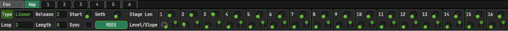

Envelopes can be looping, releaseing, or both (or neither). 
Either linear or exponential, comes with visual MSEG editor. 
To recreate a regular ADSR, set loop start and release to the same segment, and set loop length to 0. 
In terms of ADSR, the loop stage acts as the sustain stage and everything after release point acts as the release stage. 
The Voice Amp env controls voice lifetime.
All other envelopes are cut short if they are not finished yet by the time the voice is done.

With both loop and release turned off, the engine just follows the envelope with no regard for note-off events. 
With only release turned on, immediately jumps to the release point on note off, but taking the current level into account. 

With only loop turned on, the envelope becomes repeating (infinite length). 
To prevent infinite length voices, the audio engine specifically ignores looping-only 
envelopes for the Voice Amp envelope, and jumps straight to the end on note-off. 

With both loop and release turned on, the engine jumps from the current loop stage to the release point 
ONLY if the release point is after the current loop stage. This also takes into account the current level.

### Main section
* Start: controls the envelope start level
* Type: choose between linear and exponential envelopes
* Sync: switches between time-based and tempo-based (bars)
* Loop start/length: these define the (optional) sustain stage
* Smooth: applies a smoothing filter to the envelope output. 
Useful for looping envelopes where the start and end point have unequal level.
* Release point: the envelope jumps to here on note-off 
(Except if before the current loop stage, in which case looping is just finished and the envelope plays out normally.)

### Stage section
Controls individual stage length (time or bars), stage level and slope for exponential mode. 
Every control in here can also be edited using the MSEG editor but it's nice to have them anyway. 
The stage controls react to automation and modulation both, the MSEG editor reacts only to automation. 
Also unlike the editor, stage controls have a regular context menu attached to them so can show the host context menu.

### MSEG editor
Construct the envelope by dragging and clicking around.

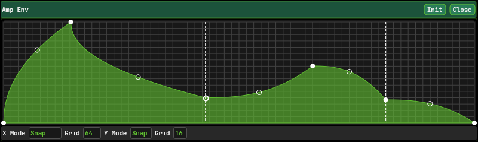

* Drag the start point up/down to control the initial level
* Drag a slope point around (exponential mode) to control the stage slope.
* Drag a stage point around to control the length of the stages before and after it as well as the point level.
* Double-click the start point or a slope point to set to default value.
* Double-click a stage point to delete the preceding stage.
* Double-click anywhere else in the envelope to insert a stage.

Vertical edit mode (Y Mode): allows to vertically snap points to a user-defined grid size. 
Horizontal edit mode (X Mode): 
Snap mode allows to horizontall snap points to a user-defined grid size. 
Stretch mode allows to shorten/lengthen a stage without affecting the stage after it. 
Off: turns off horizontal editing alltogether. Useful in combination with tempo-synced envelopes, when you just want to manually select the stage bars. 
For horizontal editing tempo-synced envelopes, the editor will snap to nearest available bars (so you end up with stuff like 11/128 etc).

Snapping is an edit-only feature. 
Envelope points can become "unsnapped" from the grid by automation or modulation, or dragging the stage controls. 
During MSEG editing the time and tempo-synced (bars) stage length are kept in sync, with the bars version being rounded to nearest. 

### CV Outputs
* Envelope output only.

## CV-Only Modules
These have no GUI and no user-controllable parameters, they just provide CV outputs for use in the matrix.

### MIDI
Mirrors incoming MIDI events.

#### CV Outputs
* Mod Wheel
* Pitch Bend
* 128 CC parameters

### Voice Note
Provides a set of fixed values at the start of the voice (so, fixed for voice lifetime).

#### CV Outputs
* Velo: MIDI key velocity
* Key: MIDI key note (excluding microtuning)
* RndUni/RndNorm: 3x random generators fixed at voice start, both uniform and gaussian.
* GrpRndUni/GrpRndNorm: likewise, but these are the same across all voices in a global unison group.

### Global Note
This is a continuously updated matrix of MIDI note events. 
Does not include microtuning.

#### CV Outputs
* Last Key Key, Current Low Key Key, Current High Key Key, Current Low Velocity Key, Current High Velocity Key
* Last Key Velocity, Current Low Key Velocity, Current High Key Velocity, Current Low Velocity Velocity, Current High Velocity Velocity
* Plus smoothed versions (react to Settings MIDI/Automation smoothing)

# Mod Matrix
25 per-voice slots and 12 global slots. 
For per-voice, provides on-note (ON Master, ON GLFO etc) versions of global sources (this is just sample-and-hold). 
See per-module CV outputs for a description of available matrix sources.

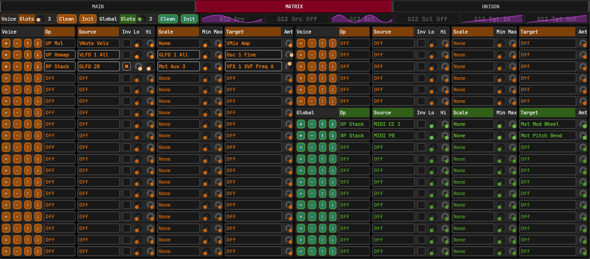

Unlike FF1 there is no distiction between CV-to-Audio and CV-to-CV anymore. 
Anything goes, provided the source module comes before (in processing order) the target module (see Routing Overview). 

The matrix provides it's own set of graph plots. 
These are not based on real input, but shows what a sine modulator would do to a ramp signal for current parameter values. 
Calculating the "real stuff" would require to run the entire synth to provide some plots (and also doesn't count in MIDI and clap modulation).

In case multiple sources target a single parameter, things are applied in order. 
So, add source A to target T, then multiply target T by source B, comes out different vs multiply by B first, then add A. 
There are dedicated operator types for "stacking" (stack A,B,C in order to T), which take current headroom into account, so don't clip. 
The matrix plots take stacking multiple sources to a single target into account. See also Modulation System.

## Main section
* Init: set matrix to default values.
* Clean: removes inactive slots and minimizes slot count.
* Slot count: selects maximum active slot count. 
Be sure to set this as low as possible, as even inactive slots take up some cpu.

## Ordering
Just a couple controls to swap slots around and delete/insert empty slot at a specific position (since processing order matters).

## Slot section
* Inv: 
Invert source.
* Operator type: defines how to apply source to target.
 See Modulation System.
* Source: source signal. 
For global matrix, all global CV sources. 
For voice matrix, all global CV sources, all per-voice sources, and on-note versions of all global sources.
* Lo/Hi: these clamp the source to a range and then scales back to full-scale. 
Use case: use a pitch tracking source (like MIDI key) and get a full scale signal from playing f.e. a 2-octave keyboard range. 
This requires a bit of tweaking, say you want an input range of C4-C6 to get a full-scale signal, set low to 60/127 and set high to 84/127.
* Scale: 
Optional additional source that scales the target amount parameter, not the source (hence the need for the invert option).
* Min/max: 
Controls how much the scale affects the target amount parameter.
* Target: 
Modulation target.
* Target amount: 
How much does the source signal affect the target signal (adjusted by scale).

# Global Unison

Global unison module with up to 8 voices and a bunch of per-voice controllable target parameters. 
When enabled (voice count > 1), each incoming MIDI note kicks off multiple voices which all react (continuously) to the unison parameters. 
Each spawned voice in this case becomes part of the same global unison group. 
See also per-group on-note-random sources in the mod matrix / voice-note module. 
Global unison-spawned voices are otherwise not "special" - they each come out of the 64 available voices. 

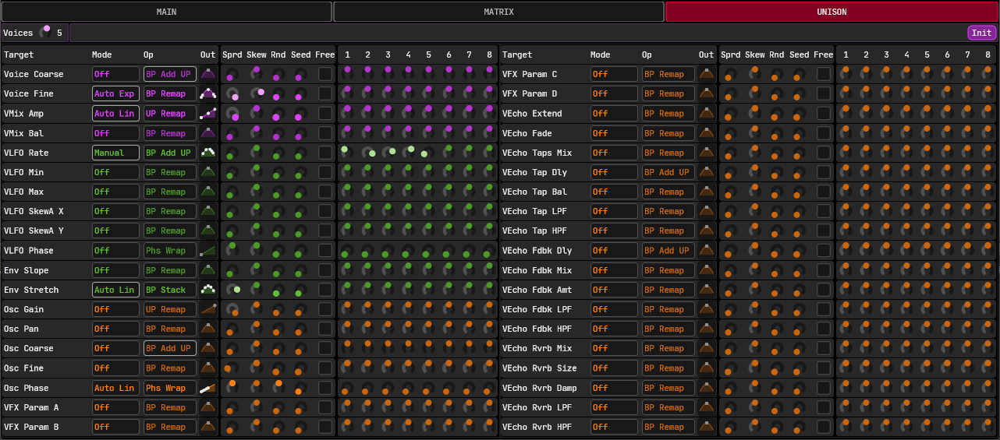

Global unison is as much a global-level feature as it is a voice-level feature. 
The idea is to build up a voice "spectrum" (f.e. 25%, 50%, 75% with 50% being center) 
per parameter, and apply it to a target parameter for all voices in a group. 
For example, have 3 voices and set fine pitch for each of them to -50/0 (center)/+50%. 
Voice spectrum can either be build up by hand (manual mode) or automatically by spread, skew and randomize parameters. 
All manual and automatic parameters are themselves continuously automatable and modulatable targets, 
so participate in the global mod matrix.

In terms of modulation, global unison always comes last (after CLAP mod, matrix and dedicated modulators). 
In order to do this correctly, FF2 contains a couple modulation operators designed specifically for unison. 
These are the "remap" operator types (default for most slots) which take an already-modulated signal and remap it according to the voice position in the spectrum.
Example: have 2 unison voices with an already-modulated stereo balance (f.e. by matrix) between 0 and 100% (hard left to hard right).
Now set voice 1 spectrum position for the VMix Balance parameter to 25% and voice 2 to 75%. 
Voice 1 stereo balance now modulates from 0% to 50%, voice 2 from 50% to 100%.

Key insight here (at least it was for me when i build the thing): 
All global unison parameters are global parameters - not per voice parameters. 
They affect voices, but not necessarily a single voice. 
Changing a single parameter position in the spectrum affects that specific voice's parameter in all currently active groups. 
For example, have a patch with a long envelope release, set global unison voice count to 3, rapidly play "A-B-C". 
You now have 9 voices, 3 in the "A" group, 3 in the "B" group, and 3 in the "C" group. 
Now set voice fine pitch target to manual mode and play around with the "Manual Voice Fine 1" parameter. 
This will affect the first voice in the A group as well as the first voice in the B and C groups, but not the A/B/C groups as a whole. 
Of course, when not in manual but in automatic mode, and you play around with the spread and skew parameters, 
that will affect the entire spectrum and in this example modulate all 9 voices at once.

## Main section
* Init: reset to default values.
* Voice count: 1 to disable, > 1 to kick off that many voices per incoming MIDI note.

## Parameter section
This controls a couple dozen hand-picked per-voice modulatable parameters. 
You can control things like voice-level pitch/gain and osci-level pitch and gain. 
Perhaps more interesting is the ability to affect voice-level echo, FX, LFO and envelopes in a group. 
For echo this allows for neat tricks like have C4 dry but with a fully-wet reverb on C5 (this idea came to me from a github ticket - thanks!). 

The envelope stretch parameter results in unequal voice lifetime for voices in a group. 
In this case, the group as a whole is "gone" only when the last voice exits. 
Normally this is not a concern, but it does come into play when using CLAP polyphonic modulators. 
A note is only reported as finished to the host when all voices in the group have cleared. 
This also means CLAP polyphonic modulators do not affect single voices - they target global unison voice groups.

To clarify: in the above example of A/B/C groups each with 3 voices: 
* You now have voices A1, A2, A3, B1, B2, B3, C1, C2, C3
* CLAP modulation targets either group A, B, or C as a whole
* Global unison modulation targets A1/B1/C1, A2/B2/C2 or A3/B3/C3

In the (typical) case when a parameter targets a multi-slot module, like oscillator, a parameter targets all module slots at once. 
For example, oscillator gain will affect all 4 oscillators.

### Shared manual/automatic parameters
* Mode: manual or automatic linear/exponential with spectrum skewing control.
* Operator: add, multiply, stack, etc. Defaults (mostly) to remap. See Modulation System.

### Manual mode
Allows full control over each voice position within all active groups.

### Automatic mode
* Linear/exponential: 
Mostly the same but exponential allows skewing the spectrum. 
Costs a bit of CPU, and needs 4+ voices.
* Spread: 
Primary control for creating the voice spectrum. 
* Skew: 
When exponential, pushes the voice positions within the spectrum towards/away from center.
* Random/seed/free: 
Randomizes the voice position in the spectrum by "Rnd" amount. 
Seed controls the backing generator, free mode allows free-running random. 
If not in free mode, the random generator is reset at each block start.
